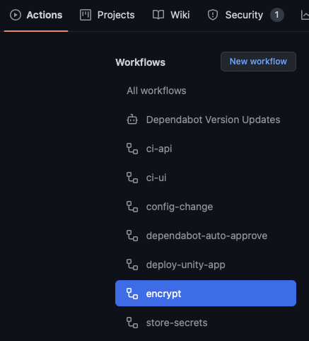
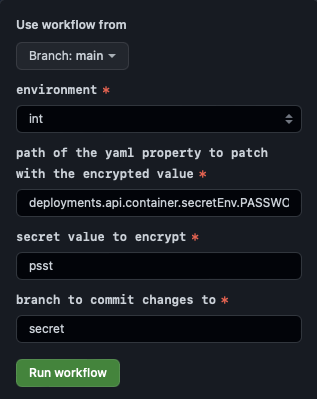
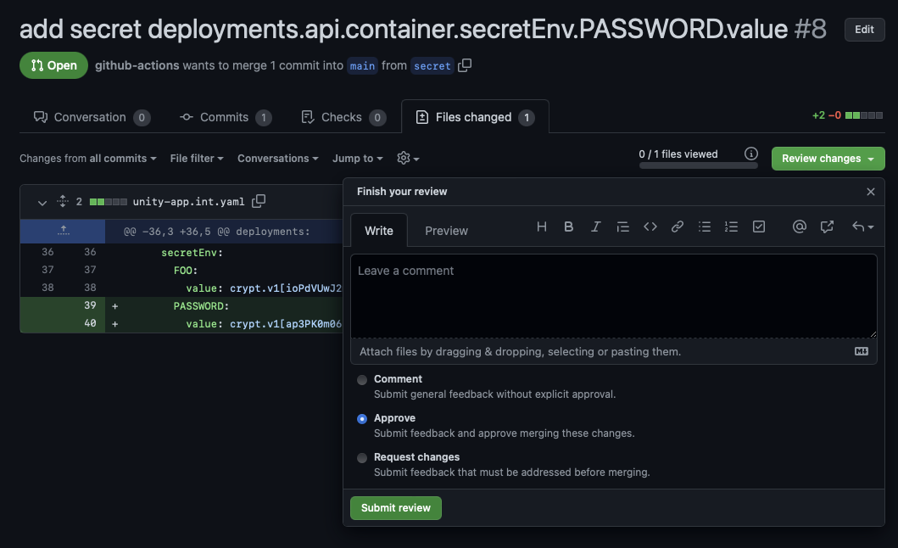
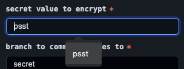

**Table of Contents**

<!-- START doctoc generated TOC please keep comment here to allow auto update -->
<!-- DON'T EDIT THIS SECTION, INSTEAD RE-RUN doctoc TO UPDATE -->

- [App Configuration](#app-configuration)
  - [Environment Variables](#environment-variables)
  - [Secrets](#secrets)
    - [Encrypt in the Browser](#encrypt-in-the-browser)
    - [Encrypt via `gh`](#encrypt-via-gh)
  - [Headers and Cookies](#headers-and-cookies)
  - [Prototypes](#prototypes)
  - [Environment Configuration with Angular](#environment-configuration-with-angular)

<!-- END doctoc generated TOC please keep comment here to allow auto update -->

# App Configuration

Apps may need environment specific configuration, such as URLs to external systems or secret information like
client-ids.

## Environment Variables

Environment variables can be configured in the `unity-app.*.yaml` files.

```yaml
deployments:
  api:
    # ...
    container:
      env:
        FOO:
          value: some-value
        BAR:
          value: another-value
```

The values may be set specific to the environment.

Especially with [Quarkus](https://quarkus.io), environment variables can be used to set all
[Config Sources](https://quarkus.io/guides/config-reference#configuration-sources).
Other configuration mechanisms, like config files, are currently not supported.

## Secrets

To configure an app with secret information, values can be stored in encrypted form in the `unity-app.*.yaml` files.

```yaml
deployments:
  api:
    # ...
    container:
      secretEnv:
        PASSWORD:
          value: crypt.v1[atAkljasdjs/0==]
```

To encrypt a value, run the `encrypt` workflow in your repository.

There are two ways to do this, via the browser or via [`gh`](https://cli.github.com).
For experts, the preferred way should be using `gh`, since there is no risk of caching secret data in the browser.

Secrets will be available in decrypted form inside the container as environment variable. This means that any user
that has access to the container can view the secret values, e.g. by running `env`.
Ideally, secret environment variables would be unset or overwritten after reading them from the application to avoid
exposing them to a potential attacker. However, this is not possible at the moment out of the box.

### Encrypt in the Browser



Specify the yaml path, e.g. `deployments.api.container.secretEnv.PASSWORD.value`, the secret value `psst` and the
environment.



The workflow will take the `CRYPT_MASTER_KEY`, stored in your repository, and encrypt the secret value.
Then a pull request will be created, which you can review, approve and merge afterwards.



🚨 Never share the `CRYPT_MASTER_KEY` with anyone, this key can be used to decrypt all the secrets in your yaml file.

⚠️ One drawback of the browser based approach is, that the secret value may be cached in the browser. Make sure the
secret information is removed from the browser after running the workflow. In Chrome this can be done by going back to
the input, navigating down with ↓ and delete the entry with Shift + Del.



You can rename the environment variable afterwards.
Note, that encryption is environment specific as `CRYPT_MASTER_KEY`s are different, so you cannot copy the encrypted
value from `int` to `prod`. Instead, run the encrypt workflow for both environments.

When deploying an app, the `deploy-unity-app` action will validate that all secrets can be decrypted with the
current `CRYPT_MASTER_KEY`. If decryption fails, the app cannot be deployed.

### Encrypt via `gh`

Make sure `gh` is installed from [cli.github.com](https://cli.github.com)
and follow [GitHub CLI quickstart](https://docs.github.com/en/enterprise-server/github-cli/github-cli/quickstart).

Next, from your repository run:

```bash
gh workflow run encrypt \
  -f "environment=int" \
  -f "yaml-path=deployments.api.container.secretEnv.PASSWORD.value" \
  -f "secret=psst"
```

## Headers and Cookies

You can also set custom headers or cookies to provide environment specific configuration for your app.
See [HTTP Headers](http-headers.html) for details.

When using cookies, keep in mind that these mey be shared on the entire domain `unity.bmwgroup.net`.
So it is recommended to use the following naming convention and config:

```yaml
deployments:
  ui:
    headers:
      response:
        add:
          Set-Cookie: app-foo-ui-environment=int; Secure; SameSite=Strict; Path=/foo/ui
```

The name of the cookie `app-foo-ui-environment` should have the following segments:

`app-<name>-<deployment>-<cookie-name>`

* `<name>` name of your app
* `<deployment>` name of the deployment (optional)
* `<cookie-name>` name of the cookie value

Setting `Path=/foo/ui` is also recommended.
Check [Set-Cookie on MDN](https://developer.mozilla.org/en-US/docs/Web/HTTP/Headers/Set-Cookie) for more details.

## Prototypes

Prototypes are UNITY applications which are not meant for productive use. They are used only for trying out different
solutions with real data. If the prototype needs to be converted to a real application, the BMW process for creating an
application needs to be followed (creating an application in ConnectIT, etc).
It is possible to mark a UNITY application as a prototype via a flag in the `unity-app-*.yaml` file:

```yaml
prototype: true
```

It is not possible to deploy an application on the UNITY production environment without either specifying an `appId` for
it or marking it as a prototype.

## Environment Configuration with Angular

Angular [recommends](https://angular.io/guide/build#configuring-application-environments) building different artifacts
for different environments such as int and prod.
However, this is in contradiction to the concept of running the same docker images on all environments, which is a good
practice to ensure environments are as close as possible. This approach is recommended by UNITY.

To have minimal environment specific configuration of an angular app, a mechanism is required that does not need to
build separate images for int and prod.
The simplest approach is to store this information in a [cookie](#headers-and-cookies).

Then, inside the app, that cookie can be accessed as follows:

```ts
/**
 * Extract cookie value by name
 * @see https://stackoverflow.com/a/15724300/1458343
 */
const getCookie = (name: string) => {
    const value = `; ${document.cookie}`;
    const parts = value.split(`; ${name}=`);
    return parts.length === 2 ? parts.pop()?.split(";")?.shift() : undefined;
  };

@Component({
  selector: "app-root",
  templateUrl: "./app.component.html",
  styleUrls: ["./app.component.scss"],
})
export class AppComponent {
  //Tag with environment for header
  environmentTagConfig: Partial<DsHeaderTagConfiguration> = {
    label: getCookie("app-foo-ui-environment"),
  };

  // ...
}
```

This little demo shows how the `environmentTagConfig` is set from a cookie `app-foo-ui-environment=int`.
In the same way, other environment specific config may be loaded, such as a URL of an external system:

*gh.service.ts:*
```ts
@Injectable({
  providedIn: 'root'
})
export class GhService {

  private url = getCookie("app-foo-ui-gh-url") ?? ''

  constructor(private http: HttpClient) { }

  getOctocat() {
    return this.http.get(this.url, {responseType: 'text'})
  }
}
```

To initialize the cookie for local development, add the following block:

*app.module.ts:*

```ts
if (isDevMode()) {
    document.cookie = `app-foo-ui-environment=dev; Secure; SameSite=Strict; Path=/foo/ui`
    document.cookie = `app-foo-ui-gh-url=https://api.github.com/octocat; Secure; SameSite=Strict; Path=/foo/ui`
}
```

and in the `unity-app.*.yaml` files add the cookie config to use

```yaml
    headers:
      response:
        add:
          Set-Cookie:
            - app-foo-ui-environment=foo; Secure; SameSite=Strict; Path=/foo/ui
            - app-foo-ui-gh-url=https://api.github.com/octocat; Secure; SameSite=Strict; Path=/foo/ui
```

Which could be set as `app-foo-ui-gh-url=https://api.github.com/octocat`

An alternative approach would be serving environment specific parameters from a backend's REST resource, which could be
configured via [environment variables](#environment-variables) or data in a database. Currently, environment variables
cannot be used directly in a nginx deployment.
