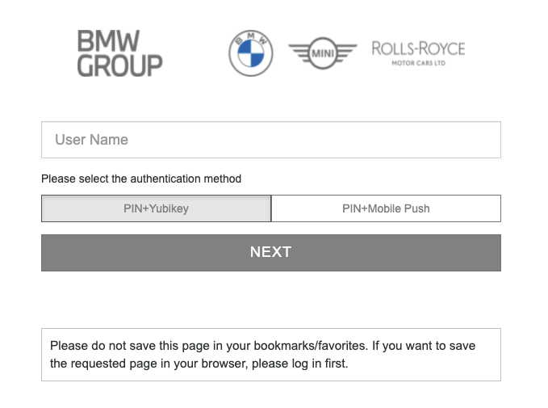

**Table of Contents**

<!-- START doctoc generated TOC please keep comment here to allow auto update -->
<!-- DON'T EDIT THIS SECTION, INSTEAD RE-RUN doctoc TO UPDATE -->

- [Authentication and Authorization](#authentication-and-authorization)
  - [Authentication](#authentication)
    - [Excluded Paths](#excluded-paths)
    - [Excluded Headers](#excluded-headers)
    - [OAuth2](#oauth2)
    - [Minimum Authentication Level](#minimum-authentication-level)
    - [K8s](#k8s)
  - [Authorization](#authorization)
    - [B2X Roles](#b2x-roles)
    - [Machine-to-Machine (M2M)](#machine-to-machine-m2m)
    - [Other Role Providers (RightNow, RoMa, Active Directory, ...)](#other-role-providers-rightnow-roma-active-directory-)
  - [User Information](#user-information)

<!-- END doctoc generated TOC please keep comment here to allow auto update -->

# Authentication and Authorization

Every UNITY app is protected by strong authentication (two-factor authentication with YubiKey) by default.

🚨 Note that the YubiKey needs to be enabled on [strong-int.bmwgroup.net](https://strong-int.bmwgroup.net) by every user, to be able to use it on the
integration environment.

The way, authentication is working can be configured in the `unity-app.*.yaml` files like shown below:

```yaml
auth:
  enabled: true
  minAuthLevel: 7000
  oauth2:
    enabled: true
  roles:
    b2x:
      any:
        - B2B_I
  k8s:
    enabled: false
```

Details on each attribute can be found in the [unity-app schema](./unity-app-yaml.md).

## Authentication

As previously stated, each app is protected with authentication by default.
In rare cases, this protection can be disabled by setting the `auth.enabled` flag to `false`. Note, that this will
expose all endpoints publicly to the entire BMW intranet!
Disabling authentication is recommended only, if the content is public, or if authentication and authorization is
implemented on the
application level. That means, the app development team is responsible for handling all traffic in a secure way.

### Excluded Paths

It is possible to exclude some paths from being access protected by authentication and authorization.

For example, the OpenAPI endpoint or the SwaggerUI page could be made public by excluding it from authorization as shown
blow.

```yaml
auth:
  excludedPaths:
    - /my-app/api/open-api/swagger-ui
    - /my-app/api/openapi
```

### Excluded Headers

It is possible disable the authentication and authorization depending on some headers values.

It is possible to also use [pseudo-headers](https://httpwg.org/specs/rfc7540.html#rfc.section.8.1.2.1).
For example, when the :method pseudo-header has one of the given values, there won't be any authentication or authorization checks.

The headers values are provided via a regular expression, which is in [Google LE2 dialect](https://github.com/google/re2/wiki/Syntax).

```yaml
auth:
  excludedHeaders:
    - name: ":method"
      valuesRegex: OPTIONS|PATCH
```

### OAuth2

If the flag `auth.oauth.enabled` is set to `true`, an unauthenticated request will initiate a redirect to the WebEAM
login screen.



This is the recommended setting for front-ends.

REST services, that are called via [XHR](https://en.wikipedia.org/wiki/XMLHttpRequest) requests, should typically not
enable OAuth2. An unauthenticated call (due to invalid or expired token or cookie) to the back-end, should not respond
with a redirect to a login-page, but with
a [401 Unauthorized](https://developer.mozilla.org/en-US/docs/Web/HTTP/Status/401) status code.
The calling web-page is responsible for reacting to this status code. The simplest possible way is to force a page
reload, which will initiate the OAuth2 flow for the user.

Here is a simple angular HTTP interceptor, which triggers the page reload.

```ts
import {Injectable} from '@angular/core';
import {
  HttpErrorResponse, HttpEvent, HttpHandler, HttpInterceptor, HttpRequest
} from '@angular/common/http';
import {catchError, Observable, throwError} from 'rxjs';

@Injectable()
export class UnauthorizedInterceptor implements HttpInterceptor {
  intercept(req: HttpRequest<unknown>, next: HttpHandler): Observable<HttpEvent<unknown>> {
    return next.handle(req).pipe(
      catchError((error: unknown) => {
        if (error instanceof HttpErrorResponse) {
          if (error.status === 401) {
            location.reload();
          }
        }
        return throwError(() => error);
      }));
  }
}
```

In addition, the interceptor must be added to the `providers` in the `AppModule`.

```ts
@NgModule({
  // ...
  providers: [
    {
      multi: true,
      provide: HTTP_INTERCEPTORS,
      useClass: UnauthorizedInterceptor,
    }
  ],
})
export class AppModule {
}
```

### Minimum Authentication Level

By default, the highest auth level (7000) is required to authenticate to a UNITY app. Currently, users need to
authenticate with a YubiKey as second factor to get the level 7000 authentication.

If the application accepts request with lower auth levels as well, it may reduce the default `auth.minAuthLevel` to a
lower value.

```yaml
auth:
  minAuthLevel: 4000
```

Note that the user will still be redirected to a login-page which requests authenticating with a YubiKey.
To redirect to a different login page, the OAuth2 flow must be initiated on the application level, as this is not
supported by UNITY out of the box. This means,

```yaml
auth:
  enabled: false
```

must be set for the UI and the SPA needs to handle the OAuth2 flow.

A typical use case would be to serve only data with a low protection need on auth level 1000 (single factor
authentication) and all data on authentication level 7000.

The current user's auth level is passed as a custom header `Unity-AuthLevel` to the upstream backend,
which can be evaluated in a Quarkus back-end like shown below.

```java
@Path("/v1/")
public class AuthLevelResource {

    @GET
    @Produces(MediaType.TEXT_PLAIN)
    public String authLevel(@HeaderParam("Unity-AuthLevel") final String authLevel) {
        return "Your auth level is " + authLevel;
    }
}
```

Read more about auth levels in the [WebEAM documentation](https://atc.bmwgroup.net/confluence/x/14S3KQ).

### K8s

If the flag `auth.k8s.enabled` is set to true, the application will be able to handle kubernetes `ServiceAccount`
tokens.

In order to connect to an application using the service account token you must set the `Authorization` header
to `Bearer <myAppsSaToken>`.
Additionally, the custom header `Unity-Authorization-Type` must be set to `Kubernetes-Service-Account`
to differentiate these requests from the ones using WEN token.

## Authorization

Simple role requirements can be configured in the `unity-app.*.yaml` files.

### B2X Roles

If the user requires a B2X role, like `PMD` or `B2B_I`, the following sample configuration can be employed.

```yaml
auth:
  roles:
    b2x:
      any:
        - PMD
        - B2B_I
```

This will reject any request with [403 Forbidden](https://developer.mozilla.org/en-US/docs/Web/HTTP/Status/403), if the
user does not have either the `PMD` or the `B2B_I` role.

More advance role checks must be performed in the application's back-end. Roles are passed as custom
headers: `Unity-B2XRole`. Note that this header is repeated, if multiple roles are requested.
Also note that only roles from the `auth.roles.b2x.any` list are passed in that header.

In a Quarkus back-end, roles can be evaluated as follows.

```java
@Path("/v1/")
public class RolesResource {

    @GET
    @Produces(MediaType.TEXT_PLAIN)
    public String roles(@HeaderParam("Unity-B2XRole") final List<String> roles) {
        return "Your roles are: " + String.join(", ", roles);
    }
}
```

### Machine-to-Machine (M2M)

It is possible to authorize [WebEAM M2M](https://atc.bmwgroup.net/confluence/x/ZYS3KQ) client ids to access the
applications. Optionally, for each of the authorized client ids, roles
may be defined which will be afterwards passed to the application via the `Unity-B2XRole` header.

The M2M authorization can be enabled via the `unity-app.*.yaml` files:

```yaml
auth:
  realm:
    machine2machine:
      client-id-1:
        roles:
          b2x:
            - PMD
            - B2B_I
```

If the client id is not allowed to access the application with any of the configured roles (defined in the `auth.roles`
section), then response will be [403 Forbidden](https://developer.mozilla.org/en-US/docs/Web/HTTP/Status/403).

Instead of the user information headers, in this case the `Unity-ClientId` header will be set to the M2M client id.

### Other Role Providers (RightNow, RoMa, Active Directory, ...)

If the app requires to use a role provider, which is not integrated into UNITY, it must be handled on application level.
This means, the `unity-app.*.yaml` file should contain a configuration, which only requests authentication:

```yaml
auth:
  oauth2:
    enabled: true
```

This will make sure, all requests passed to the application have a `Authorization: Bearer xyz...` header with a valid
WebEAM Bearer token.
With that token, any role provider can be used, either employing a custom implementation, or an extension.

## User Information

Some user (or M2M client id)'s attributes are passed as custom headers. The list below shows, what can be evaluated by
the back-end:

* `Unity-Email` e.g. `user@example.com`
* `Unity-B2XRole` e.g. `B2B_I`
* `Unity-AuthLevel` e.g. `7000`
* `Unity-UserName` e.g. `Charlie Brown`
* `Unity-UserSub` e.g. `q12345`
* `Unity-Department` e.g. `FG-123`
* `Unity-ClientId` e.g. `8eeb5128-87ad-48f3-a30b-631db0fb11e9` (header is not set for human users)

For [M2M](#machine-to-machine--m2m-) clients, only the following headers will be present: `Unity-B2XRole`
and `Unity-ClientId`.
