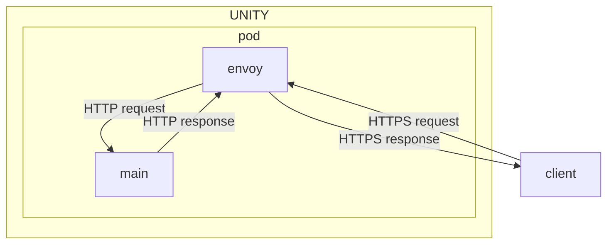
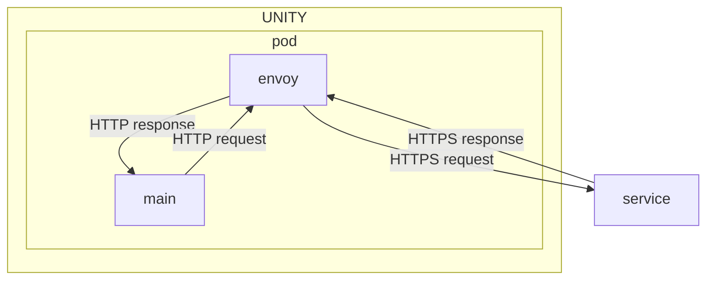

**Table of Contents**

<!-- START doctoc generated TOC please keep comment here to allow auto update -->
<!-- DON'T EDIT THIS SECTION, INSTEAD RE-RUN doctoc TO UPDATE -->

- [Certificates](#certificates)
  - [Ingress](#ingress)
  - [Egress](#egress)
    - [UNITY App Services](#unity-app-services)
    - [Other Services](#other-services)

<!-- END doctoc generated TOC please keep comment here to allow auto update -->

# Certificates

Good news, UNITY handles all certificates for you!
This section clarifies how UNITY does that.

## Ingress

The following diagram illustrates TLS termination for ingress traffic:



In this diagram, envoy terminates TLS traffic from the client and encrypts traffic with a certificate and key, provided
by UNITY. Traffic inside the pod can then be handled via plain HTTP. The application does not need to handle a
certificate key to encrypt traffic.

## Egress

The following diagram illustrates TLS termination for egress traffic:



In this diagram, the app acts a client and calls the external service through envoy. Envoy has a trust store configured,
which contains all current certificate trusted in the BMW organization. Certificates are validated using this trust
store. The app itself does not need to handle any trust stores or certificates.

### UNITY App Services

Unity integrates some services on port `8008`. This means, UNITY managed services can be called on that port. Here is an
example on how to do this in a Quarkus app:

`application.properties`

```properties
quarkus.rest-client.services.url=http://localhost:8008/services/api
```

`DevModelRangeSearch.java`

```java
@RegisterRestClient(configKey = "services")
@Consumes({MediaType.APPLICATION_JSON})
@Produces({MediaType.APPLICATION_JSON})
@Path("pip-vehicle/dev-model-ranges/v2:search")
public interface DevModelRangeSearch {

    @POST
    CompletionStage<PipSearchResultDO<DevModelRangeDO>>
    searchAsync(DevModelRangeSearchDO devModelRangeSearchDO);
}
```

### Other Services

To integrate other external services, the `unity-app.*.yaml` files need to be adjusted like shown below:

```yaml
deployments:
  api:
    # ...
    proxyPorts:
      9000:
        host:
          example.com
    replicas: 1
```

This proxy port config will allow calling `https://example.com` on `http://localhost:9000` from the app's container.

More detailed, TLS will be terminated by the envoy proxy and exposed as http endpoint without TLS inside the pod.
One caveat may be a redirect response from the external service pointing to another host. If the app's client is
configured such that it follows redirects, it may fail to connect the host from the `Location` header.

Here is a specific example.

The app calls `https://example.com` via `http://localhost:9000`

```
GET http://localhost:9000/foo/bar

< Location: https://another-example.com/foo/bar
```

This will most likely fails, since `https://another-example.com` is not trusted. It is recommended to no follow
redirects from within the app's client and configure the correct host in the app.
If this cannot be done, the app must manage the trust store itself by adding relevant certificates to the app image
trust store and the `proxyPorts` feature cannot be used.

The default protocol for `proxyPorts` is HTTP. However, other protocols are also supported. This is specified by the type
property.

```yaml
deployments:
  api:
    # ...
    proxyPorts:
      9000:
        host:
          groupdir.bmwgroup.net
        port: 636
        type: TCP
    replicas: 1
```

In this example, the application can connect (via JNDI, for example) to LDAP. The connection will be secure in this case,
UNITY will handle all SSL certificate handling.

