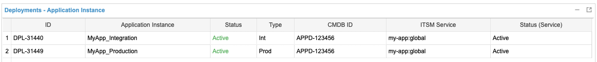

**Table of Contents**

<!-- START doctoc generated TOC please keep comment here to allow auto update -->
<!-- DON'T EDIT THIS SECTION, INSTEAD RE-RUN doctoc TO UPDATE -->

- [Connect IT](#connect-it)
  - [App-ID](#app-id)

<!-- END doctoc generated TOC please keep comment here to allow auto update -->

# Connect IT

The central system
for [Service Asset and Configuration Management](https://wiki.en.it-processmaps.com/index.php/Service_Asset_and_Configuration_Management)
at BMW is [Connect IT](https://connectit.muc).

Apps are responsible for maintaining Connect IT information. To indicate that an app runs on UNITY, the standard
platform [SPL-781: UNITY Application Ecosystem][SPL-781] should be added to the Technical Platform Elements of each app
running on UNITY.

To add UNITY, switch to the Technical Architecture tab and open the Technical Platform Elements section. Then select
*Add Existing Standard Platform...*.


Next, search [SPL-781: UNITY Application Ecosystem][SPL-781] and add it.


[SPL-781]: https://connectit.muc/ConITprod_ssl/ExternalAccess.aspx?AccessType=WorkMessage&Bookmark=3EF73F10A3414560849DC53A4D914D91

## App-ID

A valid app ID from Connect IT is required for production deployments in UNITY.
A production deployment is only possible when the `appId` is configured in the `unity-app.*.yaml` files.

```yaml
name: foo
appId: APP-123
```

Note that the UNITY team will use this information for change management and incident management. For example, the ITSM
Service of the deployment on the CMDB Information tab will be used in case of an incident.


