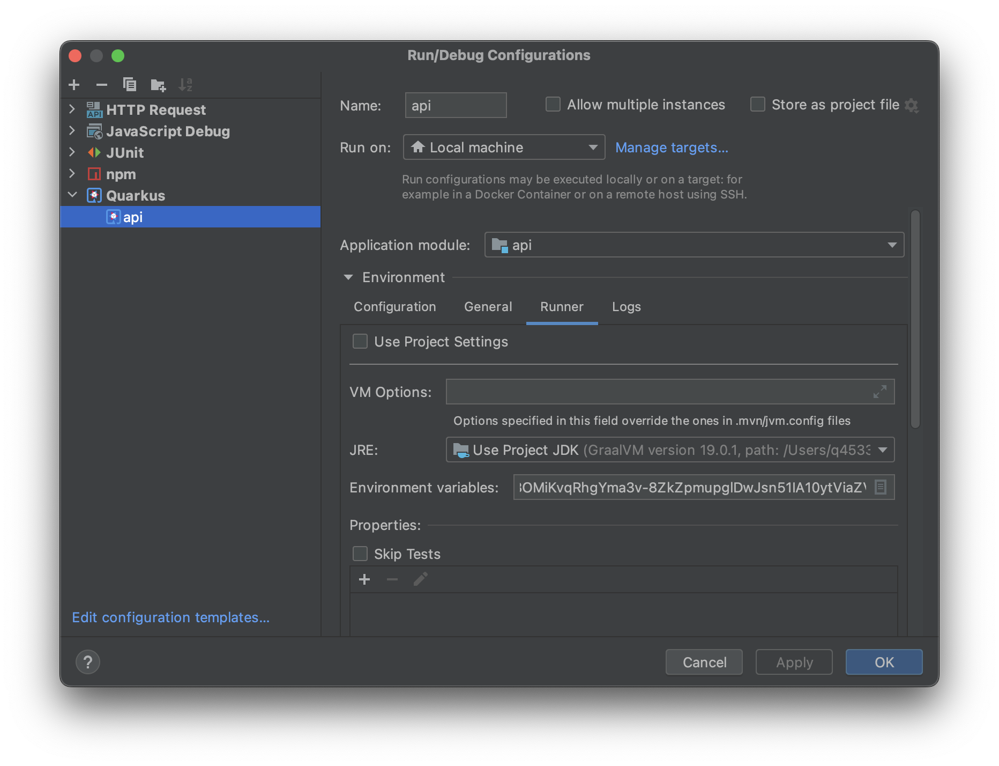
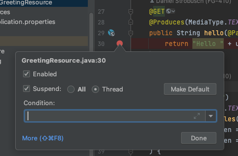
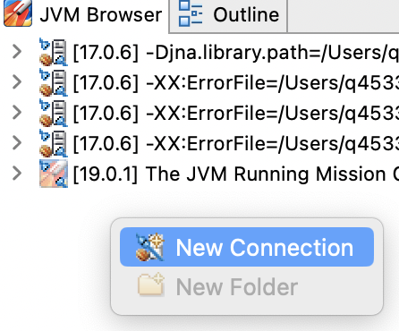
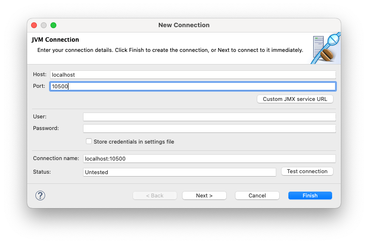
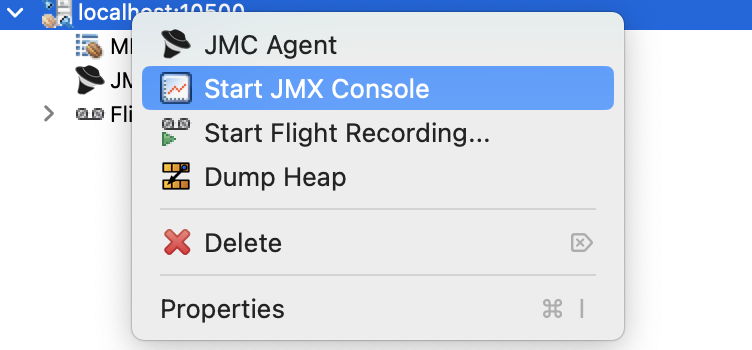
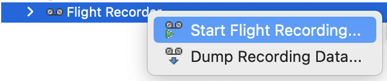
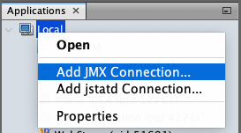
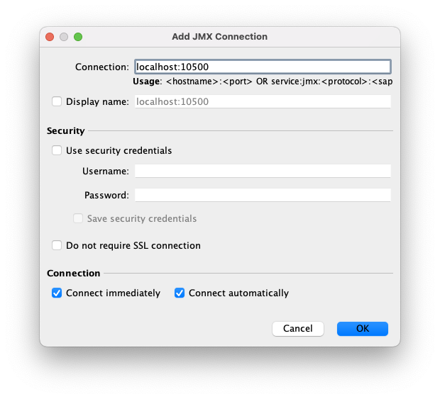
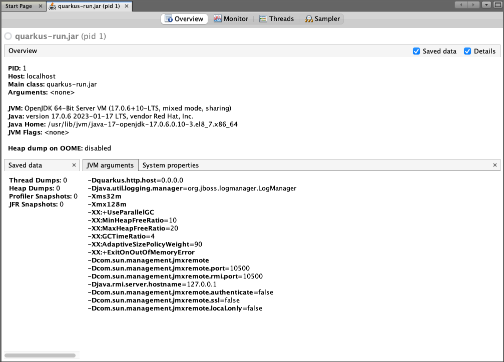

**Table of Contents**

<!-- START doctoc generated TOC please keep comment here to allow auto update -->
<!-- DON'T EDIT THIS SECTION, INSTEAD RE-RUN doctoc TO UPDATE -->

- [JVM](#jvm)
- [Remote Debugging](#remote-debugging)
- [Java Management Extensions (JMX)](#java-management-extensions-jmx)
  - [Java Mission Control (JMC)](#java-mission-control-jmc)
  - [VisualVM](#visualvm)

<!-- END doctoc generated TOC please keep comment here to allow auto update -->

# JVM

The following sections describe diagnostic techniques for JVM based containers such as debugging and profiling.

# Remote Debugging

To enable remote debugging, first prepare your application to expose the remote debugging port. Quarkus applications can
be configured by setting the `JAVA_OPTS_APPEND` environment variable. Other JVM based applications may have different
ways to configure the JVM argument.

```yaml
api:
  replicas: 1
  env:
    JAVA_OPTS_APPEND:
      value: >
        -agentlib:jdwp=transport=dt_socket,server=y,suspend=n,address=*:5005
```

💡 Scaling replicas to one, is a good idea to make sure you have only one pod running when debugging API calls via a REST
interface. Otherwise, it is hard to know if the pod you are profiling will serve the request. There will be a
performance impact on the running application. Debugging in the production environment is not recommended in general.

When the app is prepared for debugging as described above, find the [pod name](#inspect-containers-and-pods)

```bash
export "POD=app-foo-api-5c484fd67c-9x9ll"
```

and forward the JMX port locally by running:

```bash
kubectl port-forward $POD 5005:5005
```

Next, switch to your IDE. The following instructions will show how to set up a remote debugging session in IntelliJ.

To make sure that the Java classes are in sync with the source code in the IDE, it is recommended to checkout the
git revision that is deployed in the container.

Then create a new run configuration for remote debugging.



and start it in debug mode.
Then set a thread breakpoint, where you want to start debugging.



🚨 It is very important to select **Thread**, which will only stop the current thread. When stopping all threads (default
breakpoint), the container cannot respond to readiness and liveness probes. This will result in termination of that "
unhealthy" pod and the debugging session will stop after a short period of time.

To trigger the breakpoint, invoke the code by calling the REST endpoint, e.g. via Swagger UI.
If everything worked, the IDE will stop at the breakpoint and the debugging session can begin.

# Java Management Extensions (JMX)

[JMX](https://en.wikipedia.org/wiki/Java_Management_Extensions) can be used to get detailed insight into a JVM.
It includes observing the heap, garbage collection and many other JVM related data.

To enable JMX, first prepare your application. Quarkus applications can
be configured by setting the `JAVA_OPTS_APPEND` environment variable. Other JVM based applications may have different
ways to configure the JVM argument.

```yaml
api:
  replicas: 1
  env:
    JAVA_OPTS_APPEND:
      value: >
        -Dcom.sun.management.jmxremote
        -Dcom.sun.management.jmxremote.port=10500
        -Dcom.sun.management.jmxremote.rmi.port=10500
        -Djava.rmi.server.hostname=127.0.0.1
        -Dcom.sun.management.jmxremote.authenticate=false
        -Dcom.sun.management.jmxremote.ssl=false
        -Dcom.sun.management.jmxremote.local.only=false
```

💡 Scaling replicas to one, is a good idea to make sure you have only one pod running when profiling API calls via a REST
interface in the int environment. Otherwise, it is hard to know if the pod you are profiling will serve the request.
This does not apply to the prod environment, though. Profiling in prod is not recommended and if you need to do it make
sure you have a full understanding of replicas and profiling.

The instructions are based on the more general
article [Monitoring Quarkus JVM Mode With Cryostat](https://quarkus.io/blog/monitoring-quarkus-jvm-mode-with-cryostat/).

When the app is prepared as described above, find the [pod name](#inspect-containers-and-pods)

```bash
export "POD=app-foo-api-5c484fd67c-9x9ll"
```

and forward the JMX port locally by running:

```bash
kubectl port-forward $POD 10500:10500
```

💡 You can also forward multiple ports if
required: `kubectl port-forward app-foo-api-5c484fd67c-9x9ll 8080:8080 10500:10500`.

There are several clients to connect to the JMX port. [JMC](https://jdk.java.net/jmc/8/)
and [VisualVM](https://visualvm.github.io) are two alternatives described in the next sections.

## Java Mission Control (JMC)

Install [JMC](https://jdk.java.net/jmc/8/) and open it. Next, connect to the JMX connection in the JVM Browser:



Enter the mapped port:



and open the JMC Console:



Profiling can be done, using the Flight Recorder. By starting a new



After stopping it and opening the dump, the method profiling data can be inspected in the analysis result.

Discussing details of Flight Recorder and JMC is beyond the scope of this section, consult
the [JDK Mission Control Docs](https://docs.oracle.com/en/java/java-components/jdk-mission-control/) for more
information.

## VisualVM

Install [VisualVM](https://visualvm.github.io) locally. Before opening it, find out which JVM is in the container by
running

```bash
kubectl exec $POD -- jinfo 1
```

Look for something like `java.home=/usr/lib/jvm/java-17-openjdk-17.0.6.0.10-3.el8_7.x86_64` which will tell you which
JDK to use.

Next, make sure you have the correct JDK available locally.
Open the VisualVM with the correct JDK.

```bash
JAVA_HOME=/path/to/java_home/ visualvm
```

💡 It is important to use the same (major version and vendor) JVM locally for starting the Visual VM as used by the
container application, otherwise you might see "not supported for this JVM" in Visual VM later on.

Add a new JMX connection to `localhost:10500`.




Open the new connection `quarkus-run.jar (pid 1)`, which show some details already:



Checkout the **Monitor** and **Threads** tabs, which should give you some insight into your application.

The **Sampler** tab might not be available, depending on the JVM (see [JMC](#java-mission-control-jmc) for an
alternative).
