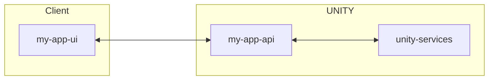
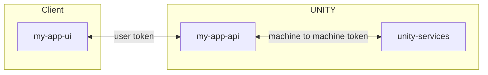
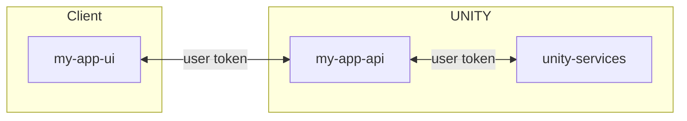
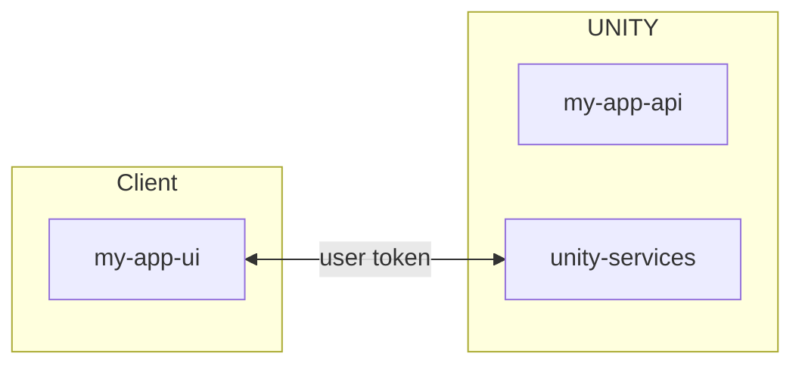

**Table of Contents**

<!-- START doctoc generated TOC please keep comment here to allow auto update -->
<!-- DON'T EDIT THIS SECTION, INSTEAD RE-RUN doctoc TO UPDATE -->

- [External Services](#external-services)
- [Architecture](#architecture)
  - [Back-End Proxy (preferred)](#back-end-proxy-preferred)
    - [Machine to Machine Authentication (preferred)](#machine-to-machine-authentication-preferred)
    - [User Token Authentication](#user-token-authentication)
  - [Direct UI integration](#direct-ui-integration)
- [Developing Locally](#developing-locally)
  - [Curl](#curl)
  - [Quarkus](#quarkus)
    - [REST Client](#rest-client)
    - [REST Resource](#rest-resource)
    - [Testing Locally](#testing-locally)
    - [Deploying to Int](#deploying-to-int)

<!-- END doctoc generated TOC please keep comment here to allow auto update -->

# External Services

UNITY integrates some services from the PDM domain. By providing a reverse proxy integration of these services,
UNITY can handle authentication and authorization, which means calling a service from within a container is as simple as

```bash
curl http://localhost:8008/services/api/pip-vehicle/dev-model-ranges/v2:search -d '{}'
```

The base URL is `http://localhost:8008/services/api`. The next segment of the URL is the service which needs to be
called (in this example, `pip-vehicle`).
The rest of the URL is the exact path on the external service. The request body is sent to the external service as is.

Here is a list of available services

* `http://localhost:8008/services/api/pip-vehicle` PIP Vehicle. For detailed information about the interface, please
  refer to the [Swagger](https://pmd-api-int.bmwgroup.net/pip-vehicle/query/wen/)
* `http://localhost:8008/services/api/logic-services`
  [Logic Services (Logikdienste)](https://pmd.bmwgroup.net/lexicon/app/term/LGCS). For detailed information about the
  interface, please refer to
  the [Swagger](https://pmd-api-int.bmwgroup.net/logic-services/wen/logic-services-business/swagger/)
* `http://localhost:8008/services/api/pdm-core`. For more information about the interface, please refer to the
  [offical documentation](https://atc.bmwgroup.net/confluence/x/jTZobQ)
* `http://localhost:8008/services/api/puk`
  [Check and Configuration Service (Prüf- und Konfigurationsdienst, PUK)](https://pmd.bmwgroup.net/lexicon/app/term/PUK).
  For detailed information about the interface, please refer to
  the [Swagger](https://pmd-api-int.bmwgroup.net/puknext/puk-webapp/swagger/#/default)
* `http://localhost:8008/services/api/hsa`
  [HSA (100% Sonderausstattung)](https://pmd.bmwgroup.net/lexicon/app/term/HSA). For detailed information about the
  interface, please refer to the [Swagger](https://pmd-api-int.bmwgroup.net/hsa/hsa-check/#/)
* `http://localhost:8008/services/api/chars`. For more information about the interface, please refer to the
  [offical documentation](https://atc.bmwgroup.net/confluence/display/PSKD/Chars)

# Architecture

When integrating your app with an external service, there are several options detailed below.
Make sure you understand the implication of these two architectures, as they have a huge impact on information
protection and user role requirements.

## Back-End Proxy (preferred)

The preferred way of using app in your `my-app-ui` is to call your own back-end: `my-app-api`. This back-end then calls
the `unity-services` endpoint.



The two subsections below detail two alternatives to handle authentication and information protection.

### Machine to Machine Authentication (preferred)



By default, UNITY will make sure that your back-end is authenticated and has some default privileges on the API call.
This means you can call any external service without the need for creating authorization tokens.
The response, received from any service, is sent as is to your back-end. You are responsible for filtering that data
according to the information protection needs before sending data toe `my-app-ui` and presenting it to the user.

### User Token Authentication



Instead of letting UNITY inject some machine to machine tokens, you can also pass the users token to a UNITY service.
In this case, the user's token is passed through to the external system.
Note that the external system must be able to accept end user tokens and must be able to evaluate the user's roles.
The up-side of this approach is, that data received from the external system may already filter according to the users
permissions if supported by the external services.
On the other hand, it can be hard to track down issues with missing roles on the user's end. Always expect that a call
may fail with `401 Unauthorized` or `403 Forbidden` when passing on a user's token.

## Direct UI integration



In this approach, the `unity-servivces` are called directly from `my-app-ui` on the user's machine.
The user's token will be passed directly to the external service.
Note that the external system must be able to accept end user tokens and must be able to evaluate the user's roles.
Data received from the external system may already filter according to the user's permissions if supported by the
external services. Otherwise, this approach will not work.
However, it can be hard to track down issues with missing roles on the users end. Always expect that a call
may fail with `401 Unauthorized` or `403 Forbidden` when passing on a users token.

# Developing Locally

The following sections detail, how one can call external services when developing locally using different technologies.

## Curl

External services can be called via a direct link provided by UNITY as shown in the example below:

```bash
curl https://unity-int.bmwgroup.net/services/api/pip-vehicle/dev-model-ranges/v2:search -d '{}' -H 'Authorization: Bearer <token>'
```

The base URL (on int) is `https://unity-int.bmwgroup.net/services/api/`.
The next segment of the URL is the service which needs to be called (in this example, `pip-vehicle`).
The rest of the URL is the exact path on the external service. The request body is sent to the external service as is.

However, in this case a valid `Authorization` header needs to be set (for example a WEN token where the user has the
necessary roles if the service uses WEN). If the header is set, it will be directly passed to the service,
without UNITY making any changes to the header.

Alternatively, a service account token can be used for authentication, which can be obtained via the `store-secrets`
workflow which is generated together with the application.
In addition, the custom header `Unity-Authorization-Type: Kubernetes-Service-Account` must be set as shown below.

```bash
curl https://unity-int.bmwgroup.net/services/api/pip-vehicle/dev-model-ranges/v2:search -d '{}' -H 'Authorization: Bearer <sa-token>' -H 'Unity-Authorization-Type: Kubernetes-Service-Account'
```

In this case, UNITY checks that the service account token is valid and will change the `Authorization` header to call
the external service. This is the most convenient way to call an external service.

## Quarkus

When developing a Quarkus application, it would be useful to be able to call the external services when developing
applications. In order to do that, the service account token is needed which can be obtained via the store-secrets
workflow.

The following section contains a step-by-step guide to implement a service integration using PIP Vehicle as example
following the [machine to machine authentication](#machine-to-machine-authentication--preferred-) approach.

### REST Client

Add the maven dependencies for the rest client to the `pom.xml`, as also described
in [USING THE REST CLIENT](https://quarkus.io/guides/rest-client).

```xml

<dependencies>
  <dependency>
    <groupId>io.quarkus</groupId>
    <artifactId>quarkus-rest-client-reactive</artifactId>
  </dependency>
  <dependency>
    <groupId>io.quarkus</groupId>
    <artifactId>quarkus-rest-client-reactive-jackson</artifactId>
  </dependency>
</dependencies>
```

The `quarkus-rest-client-reactive-jackson` dependency ensures that `records` are automatically mapped to JSON by
the [Jackson](https://github.com/FasterXML/jackson) framework.

Next create the REST client interface.

```java
@RegisterRestClient(configKey = "unity-services")
@Consumes({MediaType.APPLICATION_JSON})
@Produces({MediaType.APPLICATION_JSON})
@Path("/pip-vehicle/")
public interface PipVehicle {

    @POST
    @Path("/dev-model-ranges/v2:search")
    SearchResult<DevModelRange> searchDevModelRanges(DevModelRangeSearch request);

    record SearchResult<T>(List<T> result) {
    }

    record DevModelRange(String devModelRangeCode) {
    }

    record DevModelRangeSearch(List<String> devModelRangeCodes) {
    }
}
```

The `application.properties` should be extended by a few properties for local development

```
quarkus.rest-client.unity-services.url=http://localhost:8008/services/api
%dev.quarkus.rest-client.unity-services.url=https://unity-int.bmwgroup.net/services/api
%dev.quarkus.tls.trust-all=true
%dev.quarkus.log.category."org.apache.http".level=DEBUG
```

* `rest-client.unity-services.url` is the base URL of the service, which will be used by the client annotated
  with `@RegisterRestClient(configKey = "unity-services")`.
* `tls.trust-all=true` can be safely set on `dev`, to ignore certificate validation. In UNITY, certificates will
  properly be validated by the sidecar.
* `log.category."org.apache.http".level=DEBUG` this optional setting can be helpful to see requests in the logs.

### REST Resource

To use the client, create a simple rest resource, calling the service:

```java
@Path("/v1/")
public class PipResource {

    @Inject
    @RestClient
    PipVehicle pipVehicle;

    @GET
    @Path("pip/{code}")
    @Produces(MediaType.APPLICATION_JSON)
    public CompletionStage<PipVehicle.SearchResult<PipVehicle.DevModelRange>> devModelRange(
        @Parameter(hidden = true) @HeaderParam("Unity-UserName") final String userName,
        @PathParam("code") String code
    ) {
        return pipVehicle.searchDevModelRanges(new PipVehicle.DevModelRangeSearch(List.of(code)));
    }
}

```

### Testing Locally

In order to test the service integration locally, a custom client headers factory needs to be created.

```java
@ApplicationScoped
public class CustomAuthorizationHeaderFactory extends ReactiveClientHeadersFactory {

  @ConfigProperty(name = "kubernetes-token")
  Optional<String> saToken;

  @Override
  public Uni<MultivaluedMap<String, String>> getHeaders(MultivaluedMap<String, String> incomingHeaders, MultivaluedMap<String, String> clientOutgoingHeaders) {
    return Uni.createFrom().completionStage(() -> CompletableFuture.supplyAsync(() -> {
      if (ConfigUtils.isProfileActive("dev")) {
        clientOutgoingHeaders.put(AUTHORIZATION, List.of("Bearer " + saToken.orElseThrow(
                () -> new MissingResourceException("Kubernetes service account token was not found",
                        String.class.getName(), "kubernetes-token"))));
        clientOutgoingHeaders.put("Unity-Authorization-Type", List.of("Kubernetes-Service-Account"));
      }
      return clientOutgoingHeaders;
    }));
  }
}
```

This factory sets the `Authorization` and `Unity-Authorization-Type` headers on every request, if the `dev` Quarkus
profile is active.
To use the factory in the REST client, annotate it with:

```java
@RegisterClientHeaders(CustomAuthorizationHeaderFactory.class)
@RegisterRestClient(configKey = "unity-services")
@Consumes({MediaType.APPLICATION_JSON})
@Produces({MediaType.APPLICATION_JSON})
@Path("/pip-vehicle/")
public interface PipVehicle {
  // ...
}
```

When starting Quarkus locally the `KUBERNETES_TOKEN` environment variable needs to be set.

In IntelliJ, this can be set in the run configuration under **Runner > Environment variables**.


The token can be downloaded after running the `store-secrets` action in your repository as described
[here](https://pages.atc-github.azure.cloud.bmw/UNITY/unity/app-dev-handbook/kubernetes.html)

Copy the token from the `secrets.kdbx` to the `KUBERNETES_TOKEN` environment variable.

⚠️ Never add the token to your source code, this is confidential information, which should not be shared in plain text.
⚠️ The token may be updated by the UNITY platform at any time. So if the token is not valid anymore after some time,
just download a new one.

After the environment was configured correctly, start Quarkus and call the endpoint:

```bash
curl -X GET "http://localhost:8080/my-app/api/v1/pip/G20"
```

This should result in the following JSON response:

```json
{
  "result": [
    {
      "devModelRangeCode": "G20"
    }
  ]
}
```

If the response is not properly JSON formatted, make sure the following dependency is in your `pom.xml`, as this takes
care of mapping the response `record` to JSON.

```xml

<dependency>
  <groupId>io.quarkus</groupId>
  <artifactId>quarkus-resteasy-reactive-jackson</artifactId>
</dependency>
```

### Deploying to Int

Next, deploy your code to `int` and enjoy UNITY 🚀.
