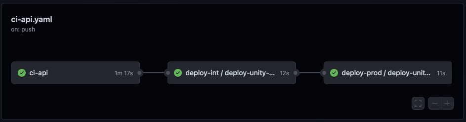
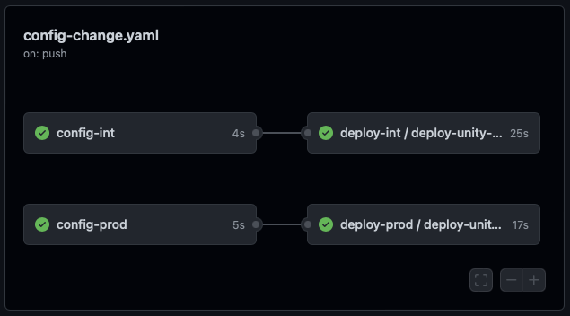

**Table of Contents**

<!-- START doctoc generated TOC please keep comment here to allow auto update -->
<!-- DON'T EDIT THIS SECTION, INSTEAD RE-RUN doctoc TO UPDATE -->

- [Getting Started](#getting-started)

<!-- END doctoc generated TOC please keep comment here to allow auto update -->

# Getting Started

After an app was created through the [New App][New App] workflow, a repository with source code was generated.
In addition, workflows that build and push docker images to the GitHub container registry have been created, if you
chose to create an Angular and or Quarkus stub in the "New App" issue template.
These default workflows are just a starting point and may be customized later on.
After the first images are build from the source code, they are automatically deployed, based on the configuration
inside the [`unity-app.*.yaml` files](./unity-app-yaml.md).

Any change to the source code or `unity-app.*.yaml` files in the `main` branch of the repository will be rolled out
automatically.
The diagrams below give a short overview.

Source code changes are handled by the `ci-*` workflows, there is one of those workflows per deployment. The diagram
below shows a workflow for the `api` deployment.

Changes to an `unity-app.*.yaml` file are handled by the `config-change` workflow. If there are only changes to
the `unity-app.int.yaml` file, only the first workflow would be executed.

Looking at the workflow files and logs of these workflows may help to get a deeper understanding of the setup.

[New App]: https://atc-github.azure.cloud.bmw/UNITY/unity/issues/new?assignees=&labels=new+app%2C+waiting+for+review&template=new-app.md&title=New+UNITY+App

