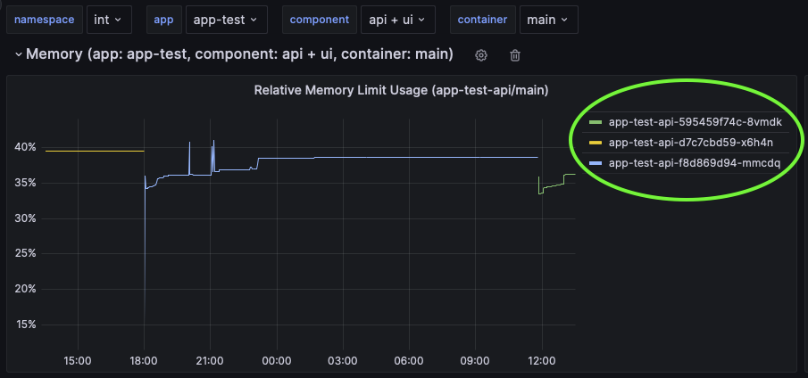

**Table of Contents**

<!-- START doctoc generated TOC please keep comment here to allow auto update -->
<!-- DON'T EDIT THIS SECTION, INSTEAD RE-RUN doctoc TO UPDATE -->

- [Kubernetes](#kubernetes)
  - [`kubectl`](#kubectl)
  - [Authenticate as Service Account](#authenticate-as-service-account)
    - [Get Service Account Token](#get-service-account-token)
    - [`kubectl` Setup](#kubectl-setup)
      - [`KUBECONFIG` (Optional)](#kubeconfig-optional)
  - [App Configuration](#app-configuration)
  - [Deployments](#deployments)
  - [Inspect Containers and Pods](#inspect-containers-and-pods)
    - [Remote Shell](#remote-shell)
    - [Port-Forwarding](#port-forwarding)
  - [Inspect Events](#inspect-events)
  - [Container Runtime (Docker)](#container-runtime-docker)

<!-- END doctoc generated TOC please keep comment here to allow auto update -->

# Kubernetes

All your containers run in a [Kubernetes](https://kubernetes.io) cluster, maintained by the UNITY team.
The following sections describe how you can get limited access to the cluster for various troubleshooting scenarios.

## `kubectl`

To access the Kubernetes cluster, it is recommended to use [`kubectl`](https://kubernetes.io/docs/tasks/tools/#kubectl).
Follow the instructions to install `kubectl` for your operating system (Linux, MacOS, Windows).

Make sure you can run the following command locally.

```bash
kubectl version --client=true
```

The steps, to access the Kubernetes cluster are detailed next.

## Authenticate as Service Account

To be able to interact with the cluster's API server a token plus some additional config is required.
In UNITY, for every app there is a service account, which is a technical identify, that can be used to interact with the
cluster. The token is securely stored in GitHub Enterprise as repository secret.

### Get Service Account Token

Downloading the token is possible using the `store-secrets` workflow in your app's repository.


After the action has completed successfully, the `secrets.kdbx` file can be downloaded from the **Summary > Artifacts**
section. This file can be opened later with the password provided when starting the workflow, and it will contain the
secrets from the GitHub repository.

🚨 Note that the token may be rolled (new token is generated) by UNITY from time to time. Extracting the service account
token is meant for development purposes and must not be used for external service interaction.


### `kubectl` Setup

The `secrets.kdbx` contain three environment specific secrets to interact with the Kubernetes cluster.
Export all three environment variables in a shell (fill in the actual values from the `secrets.kdbx`).

```bash
export KUBERNETES_HOST=...
export KUBERNETES_NAMESPACE=...
export KUBERNETES_TOKEN=...
```

Now you can interact with the clusters API server. Validate, by running:

```bash
kubectl --server "https://$KUBERNETES_HOST" --namespace "$KUBERNETES_NAMESPACE" --token "$KUBERNETES_TOKEN" version --client=false
```

This should output something like:

```console
WARNING: This version information is deprecated and will be replaced with the output from kubectl version --short.  Use --output=yaml|json to get the full version.
Client Version: version.Info{Major:"1", Minor:"26", GitVersion:"v1.26.1", GitCommit:"8f94681cd294aa8cfd3407b8191f6c70214973a4", GitTreeState:"clean", BuildDate:"2023-01-18T15:51:24Z", GoVersion:"go1.19.5", Compiler:"gc", Platform:"darwin/amd64"}
Kustomize Version: v4.5.7
Server Version: version.Info{Major:"1", Minor:"24", GitVersion:"v1.24.10", GitCommit:"5c1d2d4295f9b4eb12bfbf6429fdf989f2ca8a02", GitTreeState:"clean", BuildDate:"2023-01-27T22:54:20Z", GoVersion:"go1.19.5", Compiler:"gc", Platform:"linux/amd64"}
WARNING: version difference between client (1.26) and server (1.24) exceeds the supported minor version skew of +/-1
```

The last `WARNIN: Gversion difference between client (1.26) and server (1.24)...`  indicates that the current version
of `kubectl` may have some incompatibility with the server API.

You can go back and install the `kubectl` version that matches the cluster version. However, since the kubectl features
that will be used are very basic, it is likely that picking a newer version of `kubectl` will not cause any problems.

For more information about `kubectl` consult
the [official documentation](https://kubernetes.io/docs/reference/kubectl/).

#### `KUBECONFIG` (Optional)

As the example call showed, it is possible to pass `KUBERNETES_HOST`, `KUBERNETES_NAMESPACE`, and `KUBERNETES_TOKEN` on
every `kubectl` invocation.
This is a bit cumbersome, thought, when running a lot of `kubectl` commands.

To make running `kubectl` more convenient, set a `kubeconfig` up as follows:

```bash
export "KUBECONFIG=~/.kube/config-$KUBERNETES_NAMESPACE"
kubectl config set-credentials sa --token "$KUBERNETES_TOKEN"
kubectl config set-cluster "$KUBERNETES_NAMESPACE" --server "https://$KUBERNETES_HOST"
kubectl config set-context "$KUBERNETES_NAMESPACE" --user sa --namespace "$KUBERNETES_NAMESPACE" --cluster "$KUBERNETES_NAMESPACE"
kubectl config use-context "$KUBERNETES_NAMESPACE"
```

As long as the `KUBECONFIG` environment variable is set, `kubectl` can be used without specifying `--server ...` on each
call.

Test the setup by running

```bash
kubectl version --client=false
```

🚨 Note that the token is now stored inside a file (the path `KUBECONFIG` points to). To make sure the secret token is
not leaked, delete the file after you are done with `kubectl` calls.

## App Configuration

Assuming you have set the `KUBECONFIG` you can now inspect the current configuration of your app `app-foo` as follows:

```bash
kubectl get secret app-foo -oyaml
```

You can even modify the secret directly using `kubectl edited secret app-foo`, but then you should really know what you
are doing, as changes will be directly reflected into your apps deployments. A misconfiguration may result in an
unwanted downtime.

Note that the workflows in your app's repository make use of
the [deploy-unity-app](https://atc-github.azure.cloud.bmw/UNITY/deploy-unity-app) action, which uses `kubectl` and the
service account to sync the `unity-app.*.yaml` into a Kubernetes secret.

Additionally, it checks if the image and tag/sha256 combination exists and if they correspond to each other.
If sha256 parameter is not present it is added in the kubernetes secret.

## Deployments

Assuming you have set the `KUBECONFIG` you can now inspect deployments for your app `app-foo` as follows:

```bash
kubectl get deployment app-foo-api -oyaml
kubectl get deployment app-foo-ui -oyaml
```

Note that the names of the [deployments](https://kubernetes.io/docs/concepts/workloads/controllers/deployment/) are
concatenated from the app-name `app-test` and the deployment names `api`, `ui` from your `unity-app.*.yaml`.

```yaml
deployments:
  ui:
  # ...
  api:
  # ...
```

You can also find the names of the deployments
on the dashboards in [Grafana](https://pages.atc-github.azure.cloud.bmw/UNITY/unity/app-dev-handbook/telemetry.html).

## Inspect Containers and Pods

Your containers run in [pods](https://kubernetes.io/docs/concepts/workloads/pods/), which is a Kubernetes concept.
To interact with a running container, you need to interact with a pod.

Currently, it is not possible to find the pod names using `kubectl`

To find the current pod names check the dashboards
in [Grafana](https://pages.atc-github.azure.cloud.bmw/UNITY/unity/app-dev-handbook/telemetry.html).

For example the resource dashboards show the pod names:



In the example above, the only pod that is currently available in the cluster for interactive inspection
is `app-test-api-595459f74c-8vmdk`. The other two pods do not run anymore, as can be seen from the chart.

When knowing the pod name, various operations can be performed to help troubleshooting

### Remote Shell

To open a remote shell in a running container follow the example below:

```bash
kubectl exec -it app-test-api-595459f74c-8vmdk -- sh
```

This opens a remote shell (like `ssh`) which allows to inspect the internal state of the container. E.g. list files in a
temporary directly or show process info of the JVM.

```bash
sh-4.4$ jinfo 1
Java System Properties:
#Tue May 30 11:52:15 GMT 2023
java.specification.version=17
# ...

VM Flags:
-XX:AdaptiveSizePolicyWeight=90 -XX:CICompilerCount=2 -XX:+ExitOnOutOfMemoryError -XX:GCTimeRatio=4 -XX:InitialHeapSize=33554432 -XX:MaxHeapFreeRatio=20 -XX:MaxHeapSize=134217728 -XX:MaxNewSize=44564480 -XX:MinHeapDeltaBytes=524288 -XX:MinHeapFreeRatio=10 -XX:MinHeapSize=33554432 -XX:NewSize=11010048 -XX:NonNMethodCodeHeapSize=5826188 -XX:NonProfiledCodeHeapSize=122916026 -XX:OldSize=22544384 -XX:ProfiledCodeHeapSize=122916026 -XX:ReservedCodeCacheSize=251658240 -XX:+SegmentedCodeCache -XX:SoftMaxHeapSize=134217728 -XX:+UseCompressedClassPointers -XX:+UseCompressedOops -XX:+UseParallelGC

VM Arguments:
jvm_args: -Dquarkus.http.host=0.0.0.0 -Djava.util.logging.manager=org.jboss.logmanager.LogManager -Xms32m -Xmx128m -XX:+UseParallelGC -XX:MinHeapFreeRatio=10 -XX:MaxHeapFreeRatio=20 -XX:GCTimeRatio=4 -XX:AdaptiveSizePolicyWeight=90 -XX:+ExitOnOutOfMemoryError
java_command: /deployments/quarkus-run.jar
java_class_path (initial): /deployments/quarkus-run.jar
Launcher Type: SUN_STANDARD
```

🚨 You can even modify files and configuration, but keep in mind that all changes will be lost after the next pod is
started. This is for troubleshooting and experiments only.

### Port-Forwarding

To [forward a port](https://kubernetes.io/docs/tasks/access-application-cluster/port-forward-access-application-cluster/)
from a pod to your local machine you can map ports as shown below:

```bash
kubectl port-forward app-foo-api-5c484fd67c-9x9ll 8080:8080
```

If your app exposes that port to serve http requests, you should be able to open e.g. the Swagger UI page locally over
the mapped port by opening [http://localhost:8080/test/api/swagger-ui](http://localhost:8080/test/api/swagger-ui) (after
adjusting the URL).

## Inspect Events

Sometimes it is useful to inspect
the  [events](https://kubernetes.io/docs/reference/kubernetes-api/cluster-resources/event-v1/)
from the Kubernetes cluster. The application service account token is authorized to list the events from the cluster:

```bash
kubectl get events
```

## Container Runtime (Docker)

At the core of the Kubernetes cluster is a container runtime. Each Kubernetes cluster may have a different container
runtime and configuration at its heart. Most settings are security related, and sometimes it can be hard to troubleshoot
why a specific container is not running as intended. Here are a few guidelines on preparing and testing containers to
run in UNITY:

* containers must not require privileged users to run
  e.g. root user and sudo commands will not work)
  Reference: [Force the running image to run as a non-root user to ensure least privilege](https://kubesec.io/basics/containers-securitycontext-runasnonroot-true/)
* containers should run as user 10000 in group 10000
  See [UID (User Identifier) and GID (Group Identifier) in Linux](https://gggauravgandhi.medium.com/uid-user-identifier-and-gid-group-identifier-in-linux-121ea68bf510)
  for a quick explanation.
  A specific user, with uid > 10000, to run the container may be specified via `runAsUser` in the `unity-app.*.yaml`.
  Reference: [Run as a high-UID user to avoid conflicts with the host’s user table](https://kubesec.io/basics/containers-securitycontext-runasuser/)
* By default, all capabilities are dropped.
  See [An Introduction to Linux Capabilities](https://earthly.dev/blog/intro-to-linux-capabilities) for a quick
  overview.
  Specific capabilities, such as `NET_BIND_SERVICE` may be added via the `unity-app.*.yaml`.
  Reference: [Drop all capabilities and add only those required to reduce syscall attack surface](https://kubesec.io/basics/containers-securitycontext-capabilities-drop-index-all/)
* The root filesystem of a container will be readonly.
  Temporary directories that the container requires write permission to should be specified as `tmpDirs` in the `unity-app.*.yaml`.
  Reference: [An immutable root filesystem can prevent malicious binaries being added to PATH and increase attack cost](https://kubesec.io/basics/containers-securitycontext-readonlyrootfilesystem-true/)

To test a container locally, the following docker command gets quite close to the specifications above:

```bash
docker run --read-only --cap-drop ALL --user 10000:10000 my-image
```
