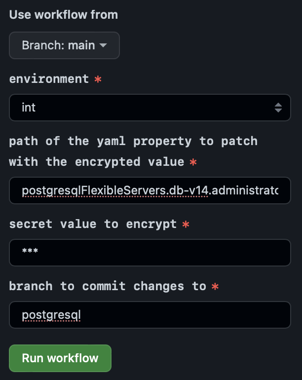

**Table of Contents**

<!-- START doctoc generated TOC please keep comment here to allow auto update -->
<!-- DON'T EDIT THIS SECTION, INSTEAD RE-RUN doctoc TO UPDATE -->

- [PostgreSQL Flexible Server (Pilot Phase)](#postgresql-flexible-server-pilot-phase)
  - [Features](#features)
  - [Limitations](#limitations)
  - [Provision New Database Server](#provision-new-database-server)
    - [Connect From Local Machine](#connect-from-local-machine)
    - [Create User and Database](#create-user-and-database)
    - [Setup Quarkus](#setup-quarkus)
  - [Change Administrator Password](#change-administrator-password)
  - [Change Stock Keeping Unit (SKU)](#change-stock-keeping-unit-sku)
  - [Migrate From a PostgreSQL Outside of UNITY](#migrate-from-a-postgresql-outside-of-unity)
  - [Replication](#replication)
    - [Promote Replica](#promote-replica)
  - [Point in Time Restore (PITR)](#point-in-time-restore-pitr)
  - [Upgrade Major PostgreSQL Version](#upgrade-major-postgresql-version)
    - [Upgrade Dry-Run](#upgrade-dry-run)
    - [Upgrade With Server Switch](#upgrade-with-server-switch)
    - [In-Place Upgrade](#in-place-upgrade)
  - [Disaster Recovery](#disaster-recovery)

<!-- END doctoc generated TOC please keep comment here to allow auto update -->

# PostgreSQL Flexible Server (Pilot Phase)

[PostgreSQL Flexible Server](https://learn.microsoft.com/en-en/azure/postgresql/flexible-server/) is an Azure Service to
run a PostgreSQL server with one or multiple databases.

UNITY offers simplified provisioning through the `unity-app.*.yaml`. Make sure to understand the implications of
configuration changes, as they may result in unwanted data loss.

⚠️ The solution is currently in piloting phase and may be tested on the integration environment. It is not sufficiently
tested for production workloads yet. The UNITY team is looking forward to your feedback.

## Features

* **Customer Managed Keys**

  Every database is provisioned with a [Customer Manged Key][concepts-data-encryption], which is automatically rotated
  every 30 days.

* **User assigned managed identity**

  Every database has
  a [user assigned managed identity](https://learn.microsoft.com/en-us/azure/active-directory/managed-identities-azure-resources/overview).

* **Point In Time Restore**

  Database servers can be restored to any point in time up to 35 days in the past. Note that only an entire database
  server can be restored to a specific point in time. If there are multiple databases on one server, there is no way to
  restore only a single database.

* **Major Version Migration**

  Automatic major version upgrades are supported. You are responsible for executing and testing the upgrades.
  Note that downgrading a major version is not possible.

* **Stock Keeping Units (SKUs)**

  Azure provides a broad range of [SKUs][sku].
  You are responsible for choosing the smallest SKU possible fulfilling your requirement, to keep costs for
  infrastructure at a minimum. By default, the smallest possible SKU will be picked, which should be sufficient to get
  started on an integration environment.

* **Network Integration**

  You database server will run in a dedicated VNET on Azure. This VNET is integrated into the BMW intranet following
  the [Azure Network Design][azure-network-design].
  In essence, the DB will be accessible from any BMW client with a `10.0.0.0/8` IP. As well as any Azure VNET, such as
  the one where your application runs.

## Limitations

* **No High Availability**

  High availability is currently disabled by default. This may change in the future.
  Read more about it in Azure's [High Availability Concept][concepts-high-availability].

* **Maintenance Windows**

  PostgreSQL Flexible Servers are security patched automatically during maintenance windows. This can lead to short
  downtimes. By default, the maintenance window is configured to start Sundays, 00:00 UTC with a duration of one hour.
  Read more about it in Azure's [Maintenance Concept][concepts-maintenance].
  Maintenance windows are currently selected by UNITY for you, if you need more ingrained control, please request a new
  feature by contacting the UNITY team.

* **No Geo Redundant Backup**

  Geo redundant backup is currently disabled by default. This may change in the future.
  Read more about it in Azure's [Geo Redundant Backup and Restore Concept][geo-redundant-backup-and-restore].

* **No Network Peering**

  Network peering with the VNET of the Kubernetes cluster for low latency connections is currently not possible, due to
  limitations on [4Wheels Managed][m4w] side. From our [tests](https://atc.bmwgroup.net/jira/browse/UNITYAPPS-617) you
  can expect a latency around 4ms and a throughput of > 270 transactions per seconds.

## Provision New Database Server

You can provision one or multiple database servers for your UNITY app as described below.

The best way to provision a new database server is to start with encrypting your administrator password.
This can be done in the same way as described in [encrypting secret environment variables][encrypt].

When running the encrypt workflow, your yaml path for a Db server named `db-v14` would be:
`postgresqlFlexibleServers.db-v14.administratorPassword`



This workflow will create a new branch with your encrypted password. You can check out the branch and extend the config
to look like the one below:

```yaml
postgresqlFlexibleServers:
  db-v14:
    administratorPassword: crypt.v1[7kQJslSOT7dQs6XlN/R4Mma27LS/gwJKJ0T63cz7u7M=]
    version: 14
```

After merging this config to the main branch and rolling it out to UNITY, the database server will be provisioned.

This config will create one database server `db-v14`.
More advanced configuration is possible with details documented in the [unity-app-yaml schema](unity-app-yaml.html) and
in the sections below.

### Connect From Local Machine

🚨 Spinning up your database can take up to 30 min, so be patient before creating an incident when something does not
seam to be working after a few minutes. So far, there is no way to get notified when your database is available, this
might be added in the future.

The connection will be possible with the following parameters with [`psql`][psql].

```bash
export PGHOST='{your app repo name}-pfs-{your db server name}.postgres.database.azure.com'
export PGUSER=postgres
export PGPORT=5432
export PGDATABASE=postgres
export PGPASSWORD='{your-password}'
psql
```

So for example, when your app is called `foo`, your DB server is called `db-v14`, and
the password `change-me`, then the upper variables will look like:

```bash
export PGHOST='app-foo-pfs-db-v14.postgres.database.azure.com'
export PGUSER=postgres
export PGPORT=5432
export PGDATABASE=postgres
export PGPASSWORD='change-me'
psql
```

### Create User and Database

To enhance the security of your database, it is discouraged to use the administrator user for all tasks. Instead, it is
advisable to set up a dedicated user with minimal permissions. Follow these steps after connecting as an administrator
to [create a new user][sql-createuser] for your app, ensuring to choose a secure password, and then proceed to create a
new database.

```sql
CREATE DATABASE int ENCODING 'utf-8' LOCALE 'en_US.utf8';
CREATE USER api WITH ENCRYPTED PASSWORD 'change-me';
GRANT ALL PRIVILEGES ON DATABASE int TO api;
```

It is essential to restrict the [privileges][sql-grant] of each user to only the actions they require. For improved
security, consider having separate users with different sets of permissions: one for creating the schema and others for
read and write operations.

Remember that it is best practice to maintain only one database per server, as [PITR](#point-in-time-restore-pitr) will
be available for the entire server and not for individual databases. This approach ensures a more streamlined and
efficient database management process.

### Setup Quarkus

Quarkus can be set up in various ways to connect to a PostgreSQL database. Recommended articles on the topic are

* [Configure Data Sources in Quarkus][quarkus-datasource]
* [Reactive SQL Clients][reactive-sql-clients]
* [Using Flyway][quarkus-flyway]
* [Using Hibernate Orm and Jakarta Persistence][quarkus-hibernate-orm]
* [Simplified Hibernate Orm With Panache][hibernate-orm-panache]

The guideline below will demonstrate a minimal setup using Hibernate and Panache to implement a simple REST resource.

Add all relevant quarkus extensions

```bash
mvn quarkus:add-extension -Dextensions="jdbc-postgresql,quarkus-hibernate-orm-panache,quarkus-flyway,resteasy-reactive-jackson"
```

Configure the database connection as environment variables on the Quarkus deployment to connect to the database from a
deployed app:

```yaml
deployments:
  api:
    # ...
    container:
      # ...
      env:
        QUARKUS_DATASOURCE_DB_KIND:
          value: postgresql
        QUARKUS_DATASOURCE_DB_VERSION:
          value: "14"
        QUARKUS_DATASOURCE_USERNAME:
          value: api
        QUARKUS_DATASOURCE_JDBC_URL:
          value: jdbc:postgresql://app-foo-pfs-db-v14.postgres.database.azure.com:5432/int
      secretEnv:
        QUARKUS_DATASOURCE_PASSWORD:
          value: crypt.v1[7kQJslSOT7dQs6XlN/R4Mma27LS/gwJK0JT36cz7u7M=]
```

Note that `QUARKUS_DATASOURCE_PASSWORD` should contain the [encrypted value][encrypt] of the user's password.

Here are a few notes on the most important config options:

* `quarkus.hibernate-orm.second-level-caching-enabled` is recommended to be set to `false` in
  the `application.properties`
  for a stateless multi replica deployment, to avoid inconsistent cache state between replicas,
  read [Hibernate Second-Level Cache][hibernate-second-level-cache] for details.

  🚨 this is a build time config, which cannot be set in the deployment's env variables.

* [`QUARKUS_DATASOURCE_JDBC_ACQUISITION_TIMEOUT`][QUARKUS_DATASOURCE_JDBC_ACQUISITION_TIMEOUT]
  can require some adjustments when you find `Acquisition timeout while waiting for new connection` errors on startup in
  the logs.
  This is an indication that setting up the connection to the database takes too long. One way is to
  increase `QUARKUS_DATASOURCE_JDBC_ACQUISITION_TIMEOUT` to e.g. `10` seconds.
  It is strongly recommended, though, to check the CPU requests and limits, as this timeout can be an indication
  for too few resources, which is why Quarkus is running into the timeout.

* Set `QUARKUS_LOG_CATEGORY__ORG_POSTGRESQL__MIN_LEVEL` and `QUARKUS_LOG_CATEGORY__ORG_POSTGRESQL__LEVEL` to `TRACE` to
  troubleshoot connection problems.

* Set `QUARKUS_LOG_CATEGORY__ORG_FLYWAYDB__MIN_LEVEL` and `QUARKUS_LOG_CATEGORY__ORG_FLYWAYDB__LEVEL` to `TRACE` to
  troubleshoot problems with flyway.

* `quarkus.hibernate-orm.metrics.enabled` is recommended to be set to `true` in the `application.properties` to expose
  metrics to
  Prometheus.

  🚨 this is a build time config, which cannot be set in the deployment's env variables.

* Set `QUARKUS_HIBERNATE_ORM_LOG_SESSION_METRICS` to `true` to see metrics on Hibernate sessions in the logs.
  This requires `quarkus.hibernate-orm.metrics.enabled` to be `true`.

To test the connection locally, you can set the same environment variables in your IDE or use the `dev` profile in the
application properties.

⚠️ Make sure to never commit the content of `QUARKUS_DATASOURCE_PASSWORD` in a run configuration or properties file.

For managing the schema, it is recommended to use [flyway][quarkus-flyway]. It is beyond the scope of this documentation
to give detailed instructions on [flyway](https://flywaydb.org).

A minimal setup is to add the following `application.properties`

```properties
quarkus.flyway.migrate-at-start=true
```

⚠️ When implementing long-running schema migrations, there is the risk that the pod gets killed during startup, before
completing the migration due to failing health checks. When long-running schema migrations are required, consider
running them from a GitHub workflow or adjust health checks accordingly.

Create the schema from the following file `api/src/main/resources/db/migration/V1__baseline.sql`

```sql
CREATE TABLE dev_model_range ( id   SERIAL PRIMARY KEY, code TEXT NOT NULL );
INSERT INTO dev_model_range values (0, 'G30');
INSERT INTO dev_model_range values (1, 'G60');
```

Implement a minimal resource and entity:

```java
import io.quarkus.hibernate.orm.panache.PanacheEntity;
import jakarta.persistence.Entity;

@Entity(name = "dev_model_range")
public class DevModelRange extends PanacheEntity {

    public String code;

    public DevModelRange() {
    }
}
```

```java
import jakarta.ws.rs.GET;
import jakarta.ws.rs.Path;

import java.util.List;

@Path("/v1/dev-model-ranges")
public class DevModelRangeResource {

    @GET
    public List<DevModelRange> get() {
        return DevModelRange.listAll();
    }
}
```

This should allow to fetch the entities from the following REST resource locally:

```http
GET http://localhost:8080/foo/api/v1/dev-model-ranges/
```

Which should result in the following JSON response:

```json
[
  {
    "id": 0,
    "code": "G30"
  },
  {
    "id": 1,
    "code": "G60"
  }
]
```

## Change Administrator Password

The password for the administrator is provided by you in encrypted form, when requesting a new DB server.
password encryption follows the same steps as for [encrypting secret environment variables][encrypt].

You can update the password any time, and you are fully responsible for maintaining a secure password and rotating it in
compliance with current [work instructions](https://atc.bmwgroup.net/confluence/x/Aut7CQ).

## Change Stock Keeping Unit (SKU)

You are responsible for choosing the smallest [SKU][sku] possible fulfilling your requirement, to keep costs for
infrastructure at a minimum. By default, the smallest possible burstable SKU will be picked.

In some cases (e.g. [replication](#replication)) it is required to switch to a non-burstable
SKU (e.g. `GP_Standard_D2ds_v4`) as shown below.

```yaml
postgresqlFlexibleServers:
  db:
    sku: GP_Standard_D2ds_v4
    # ...
```

The SKU can be changed at any time and does not result in data loss. While caning the SKU the database will not be
available.

## Migrate From a PostgreSQL Outside of UNITY

You should create a dump using [`pg_dump`][pg_dump] from your original database and restore it into the new database
using [`pg_restore`][pg_restore]. Detailed instructions is currently beyond the scope of this documentation.

## Replication

> The read replica feature allows you to replicate data from an Azure Database for PostgreSQL server to a read-only
> replica. Replicas are updated asynchronously with the PostgreSQL engine native physical replication technology.

see [Read replicas in Azure Database for PostgreSQL][concepts-read-replicas].

A read replica can be set up for any database server.

Before a read replica can be set up, the source database server as well as the read replica server must be configured to
have a non-burstable SKU.
Here is a complete example:

```yaml
postgresqlFlexibleServers:
  db-v14:
    administratorPassword: crypt.v1[7kQJslSOT7dQs6XlN/R4Mma27LS/gwJKJ0T63cz7u7M=]
    version: 14
    sku: GP_Standard_D2ds_v4
  db-v14-replica:
    administratorPassword: crypt.v1[7kQJslSOT7dQs6XlN/R4Mma27LS/gwJKJ0T63cz7u7M=]
    version: 14
    mode: Replica
    sourceServerName: db-v14
    sku: GP_Standard_D2ds_v4
```

### Promote Replica

Disconnecting a read replica from its source is called promoting.
After promoting a replica it will be a standalone database server which cannot be connected to its source server later
on at any point in time.

To promote the replica from the example above, add the `replicationRole: None`.

```yaml
postgresqlFlexibleServers:
  db-v14:
    administratorPassword: crypt.v1[7kQJslSOT7dQs6XlN/R4Mma27LS/gwJKJ0T63cz7u7M=]
    version: 14
    sku: GP_Standard_D2ds_v4
  db-v14-replica:
    administratorPassword: crypt.v1[7kQJslSOT7dQs6XlN/R4Mma27LS/gwJKJ0T63cz7u7M=]
    version: 14
    mode: Replica
    sourceServerName: db-v14
    replicationRole: None
    sku: GP_Standard_D2ds_v4
```

🚨 Note, when a database server was created as replica, you need to keep the `sourceServerName` and `replicationRole`
role in the config, even if you upgrade the promoted replica to a newer version as shown below.

```yaml
postgresqlFlexibleServers:
  db-v14:
    administratorPassword: crypt.v1[7kQJslSOT7dQs6XlN/R4Mma27LS/gwJKJ0T63cz7u7M=]
    version: 14
  db-v14-replica:
    administratorPassword: crypt.v1[7kQJslSOT7dQs6XlN/R4Mma27LS/gwJKJ0T63cz7u7M=]
    version: 15
    mode: Update
    sourceServerName: db-v14
    replicationRole: None
```

Note that upgrading a server in replication mode (i.e. `replicationRole: null` is currently unsupported).

## Point in Time Restore (PITR)

⚠️ **DOWNTIME:** while restoring, make sure the original database does not receive any writes. All changes after the
restore point will be lost.

PITR is the standard way to restore corrupted data. You can restore the state of the entire database server to any point
up to 35 days in the past.

PITR will always result in a new database server! So the original server will always stat as is. After restoring a
database you can destroy the original database if not needed anymore.

Here is a step-by-step procedure to recover from corrupted data:

1. Decide if you need to shut down your app. To avoid keep writing to the original database which should be replaced, it
   might be the best approach to shut down your application while restoring your database.
   To do so, you can set all replicas to 0.
   ```yaml
   deployments:
     ui:
       replicas: 0
       # ...
     api:
       replicas: 0
       # ...
   ```
   Alternatively, you can also set your application to a read only mode, if you have prepared your application for this
   scenario.

2. Restore your database server by adding another database server with mode `PointInTimeRestore`.
   You need to keep your original database server until you have restored into you new database server.
   ```yaml
   postgresqlFlexibleServers:
     db-v14:
       version: 14
       administratorPassword: crypt.v1[7kQJslSOT7dQs6XlN/R4Mma27LS/gwJKJ0T63cz7u7M=]
     db-v14-pitr:
       administratorPassword: crypt.v1[7kQJslSOT7dQs6XlN/R4Mma27LS/gwJKJ0T63cz7u7M=]
       version: 14
       mode: PointInTimeRestore
       sourceServerName: db-v14
       pointInTimeRestoreUTC: "2023-07-21T08:55:00Z"
   ```
   🚨 the destination server must have the same major version as the source server.
   🚨 Note that `sourceServerName` and `pointInTimeRestoreUTC` restore must be kept in the config, even if a version
   upgrade is done or if the source server is deleted.

3. Verify new DB is up and running.
   As soon as the recovery process completed, you should verify that it is up and running. Try connecting to your new DB
   with e.g. [`psql`][psql].
   ```bash
   export PGHOST=app-foo-pfs-db-v14-pitr.postgres.database.azure.com
   export PGPORT=5432
   export PGDATABASE=int
   export PGUSER=postgres
   export PGPASSWORD="{your-password}"
   pslq
   ```
4. Switch your app to the new database (and scale it up again)
   To do so, change the connection URL of your app to the new URL and scale up replicas.
   ```yaml
   deployments:
     ui:
       replicas: 1
       # ...
     api:
       replicas: 1
       env:
        QUARKUS_DATASOURCE_JDBC_URL:
          value: jdbc:postgresql://app-foo-pfs-db-v14-pitr.postgres.database.azure.com:5432/int
       # ...
   ```

## Upgrade Major PostgreSQL Version

You can migrate from one major version to the next one in an automated way.

⚠️ Note, once a database was upgraded to the next major version, it cannot be downgraded again.

There are several protocols you can follow, outlined in the sections below.

### Upgrade Dry-Run

It is strongly recommended to test major version migration on a PITR server before doing the actual migration.
While testing the upgrade, your app is not affected and no downtime will occur.

The basic idea is to create a [PITR](#point-in-time-restore-pitr) server of a recent timestamp.
Instead of switching your app to the restored server, you keep it running on the original DB.
The restored replica can be used to test the migration.

In detail, follow the steps below:

1. Create a PITR replica without changing the version
   ```yaml
   postgresqlFlexibleServers:
     db-v13:
       version: 13
       # ...
     db-v14:
       version: 13
       mode: PointInTimeRestore
       sourceServerName: db-v13
       pointInTimeRestoreUTC: "2023-07-21T08:55:00Z"
       # ...
   ```

2. Migrate the replica to the new version by removing the `pointInTimeRestoreUTC` and `sourceServerName` and changing
   the mode to `Update`.
   ```yaml
   postgresqlFlexibleServers:
     db-v13:
       version: 13
       # ...
     db-v14:
       version: 14
       mode: Update
       # ...
   ```

3. Verify that your new DB is working as expected.
4. Complete the test by cleaning up the test replica.
   ```yaml
   postgresqlFlexibleServers:
     db-v13:
       version: 13
       # ...
   ```

### Upgrade With Server Switch

⚠️ **DOWNTIME:** while upgrading, make sure the original database does not receive any writes. All changes after the
restore point will be lost.

This protocol follows the dry run outlined below, but combines it with a PITR.

1. Decide if you need to shut down your app. To avoid keep writing to the original database which should be replaced, it
   might be the best approach to shut down your application while restoring your database.
   To do so, you can set all replicas to 0.
   ```yaml
   deployments:
     ui:
       replicas: 0
       # ...
     api:
       replicas: 0
       # ...
   ```
   Alternatively, you can also set your application to a read only mode, if you have prepared your application for this
   scenario.

2. Restore your database server by adding another database server with mode `PointInTimeRestore` without changing the
   version.
   You need to keep your original database server until you have restored into you new database server.
   ```yaml
   postgresqlFlexibleServers:
     db-v13:
       version: 13
       administratorPassword: crypt.v1[7kQJslSOT7dQs6XlN/R4Mma27LS/gwJKJ0T63cz7u7M=]
     db-v14:
       administratorPassword: crypt.v1[7kQJslSOT7dQs6XlN/R4Mma27LS/gwJKJ0T63cz7u7M=]
       version: 13
       mode: PointInTimeRestore
       sourceServerName: db-v13
       pointInTimeRestoreUTC: "2023-07-21T08:55:00Z"
   ```

3. Verify new DB is up and running.
   As soon as the recovery process completed, you should verify that it is up and running. Try connecting to your new DB
   with e.g. psql.
   ```bash
   export PGHOST=app-foo-pfs-db-v14.postgres.database.azure.com
   export PGPORT=5432
   export PGDATABASE=int
   export PGUSER=postgres
   export PGPASSWORD="{your-password}"
   pslq
   ```
4. Migrate the replica to the new version by removing the `pointInTimeRestoreUTC` and `sourceServerName` and changing
   the mode to `Update`.
   ```yaml
   postgresqlFlexibleServers:
     db-v13:
       version: 13
       # ...
     db-v14:
       version: 14
       mode: Update
       # ...
   ```
5. Verify the upgrade succeeded.
6. Switch your app to the new database (and scale it up again)
   To do so, change the connection URL of your app to the new URL and scale up replicas.
   ```yaml
   deployments:
     ui:
       replicas: 1
       # ...
     api:
       replicas: 1
       env:
        QUARKUS_DATASOURCE_JDBC_URL:
          value: jdbc:postgresql://app-foo-pfs-db-v14.postgres.database.azure.com:5432/int
       # ...
   ```
7. Clean up the old database.
   ```yaml
   postgresqlFlexibleServers:
     # ... db-v13 removed
     db-v14:
       version: 13
       # ...
   ```

### In-Place Upgrade

⚠️ **DOWNTIME:** the database server will not be available during upgrade.

It is recommended, to perform a dry run before you do an in place upgrade.
Keep in mind that an upgrade may fail, and you should have a cut-over plan to recover from that situation.
For prototypes, and apps with very low service level objectives, it may be an option to simply do an in place upgrade.
To do so, simply update your DBs config from e.g.

```yaml
postgresqlFlexibleServers:
  db:
    version: 13
    # ...
```

to:

```yaml
postgresqlFlexibleServers:
  db:
    version: 14
    mode: Update
    # ...
```

## Disaster Recovery

If you accidentally removed a database from your configuration, the database server will be deleted including all data.

The UNITY team has undertaken several measures to recover from that disaster. In any case, you should open an incident
as soon as possible, as time matters in this case.
You will need the UNITY teams assistance in this case.

It is made sure that a backup is created from your database before applying any changes such as destroying it. These
backups are created using `pg_dump` and stored in a container.
This container will be deleted together with a database. Unlike the deleted database server, it can be recovered for 30
days. That means, **30 days after your database server was deleted, all data is deleted permanently**.

[concepts-high-availability]: https://learn.microsoft.com/en-us/azure/postgresql/flexible-server/concepts-high-availability

[concepts-maintenance]: https://learn.microsoft.com/en-us/azure/postgresql/flexible-server/concepts-maintenance

[geo-redundant-backup-and-restore]: https://learn.microsoft.com/en-us/azure/postgresql/flexible-server/concepts-backup-restore#geo-redundant-backup-and-restore

[m4w]: https://developer.bmw.com/docs/4wheels-managed/

[azure-network-design]: https://atc.bmwgroup.net/confluence/x/d7pBKQ

[sku]: https://learn.microsoft.com/en-us/partner-center/developer/product-resources#sku

[concepts-read-replicas]: https://learn.microsoft.com/en-us/azure/postgresql/flexible-server/concepts-read-replicas

[psql]: https://www.postgresql.org/docs/current/app-psql.html

[sql-createuser]: https://www.postgresql.org/docs/current/sql-createuser.html

[sql-grant]: https://www.postgresql.org/docs/current/sql-grant.html

[quarkus-datasource]: https://quarkus.io/guides/datasource

[encrypt]: app-configuration.html#secrets

[quarkus-flyway]: https://quarkus.io/guides/flyway

[concepts-data-encryption]: https://learn.microsoft.com/en-us/azure/postgresql/flexible-server/concepts-data-encryption

[reactive-sql-clients]: https://quarkus.io/guides/reactive-sql-clients

[hibernate-orm-panache]: https://quarkus.io/guides/hibernate-orm-panache

[quarkus-hibernate-orm]: https://quarkus.io/guides/hibernate-orm

[QUARKUS_DATASOURCE_JDBC_ACQUISITION_TIMEOUT]: https://quarkus.io/guides/all-config#quarkus-agroal_quarkus.datasource.jdbc.acquisition-timeout

[hibernate-second-level-cache]: https://www.baeldung.com/hibernate-second-level-cache#Cache

[pg_dump]: https://www.postgresql.org/docs/current/app-pgdump.html

[pg_restore]: https://www.postgresql.org/docs/current/app-pgrestore.html

[psql]: https://www.postgresql.org/docs/current/app-psql.html
