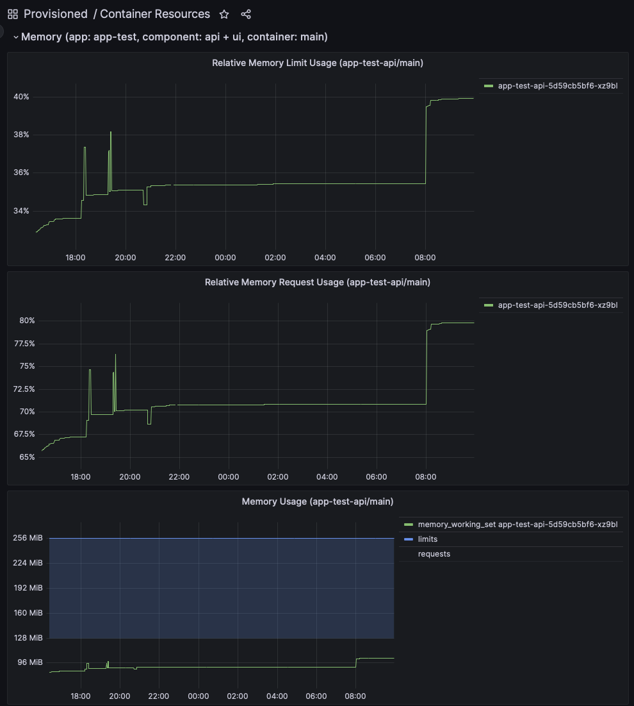
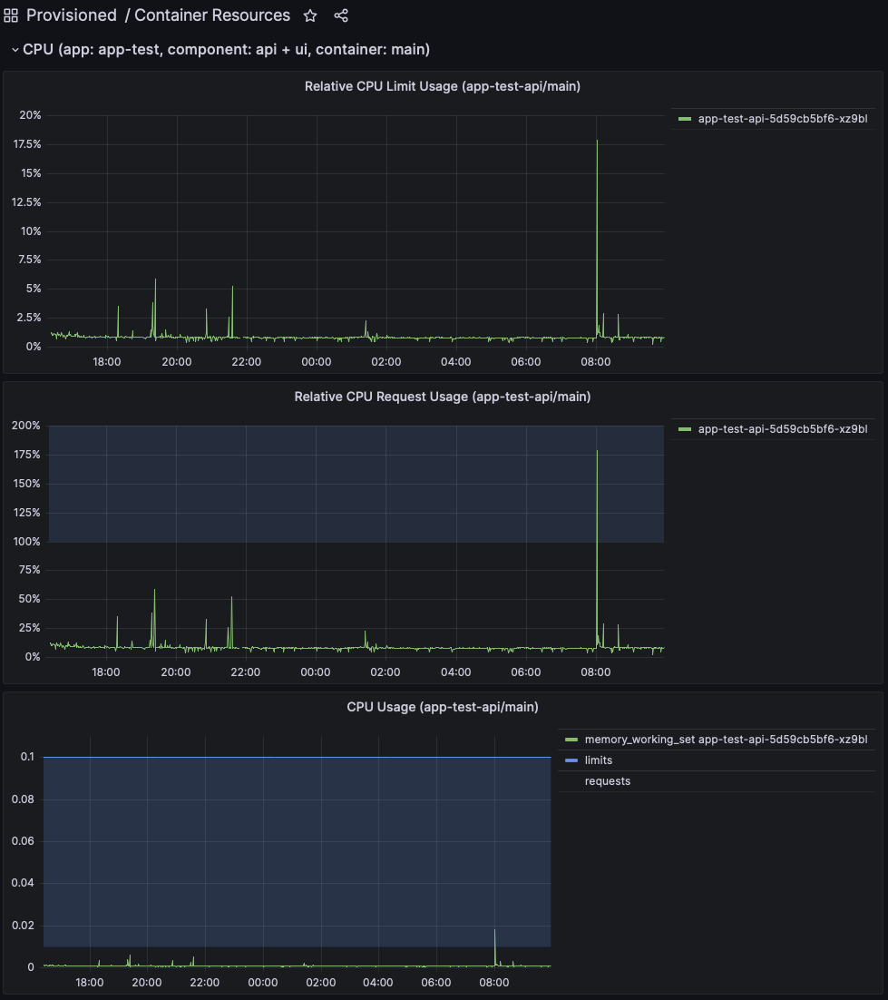

**Table of Contents**

<!-- START doctoc generated TOC please keep comment here to allow auto update -->
<!-- DON'T EDIT THIS SECTION, INSTEAD RE-RUN doctoc TO UPDATE -->

- [Resources](#resources)

<!-- END doctoc generated TOC please keep comment here to allow auto update -->

# Resources

Compute resources, such as memory and CPU requirements for the app can be configured in the `unity-app.*.yaml` files.

```yaml
deployments:
  api:
    # ...
    container:
      resources:
        limits:
          cpuMillis: 100
          memoryMiB: 512
        requests:
          cpuMillis: 10
          memoryMiB: 128
```

An ideal config would set `requests` to as many resources as the app needs when being idle (e.g. a night) and
`limit` to as many resources as needed under full load. Setting resource correctly is non-trivial.

Consult the metrics dashboards in Grafana:

* [Container Resources (int)](https://unity-int.bmwgroup.net/grafana/d/container-resources/container-resources)
* [Container Resources (prod)](https://unity.bmwgroup.net/grafana/d/container-resources/container-resources)

There are three dashboards showing the absolute and relative consumption for each app and component.
After selecting e.g. the last 24h time range, make sure the memory and CPU usage is within the request and limit range.



The example above shows that the memory consumption is always below 100% of the configured limit but is most of the time
between 70% and 80% of the requested memory. This give the best compromise of cost efficiency and stability.

The same rules apply for CPU usage, which may look like in the following example:



Always keep in mind that high resource configuration will directly result in higher costs. So just setting everything to
the maximum may raise some questions.
