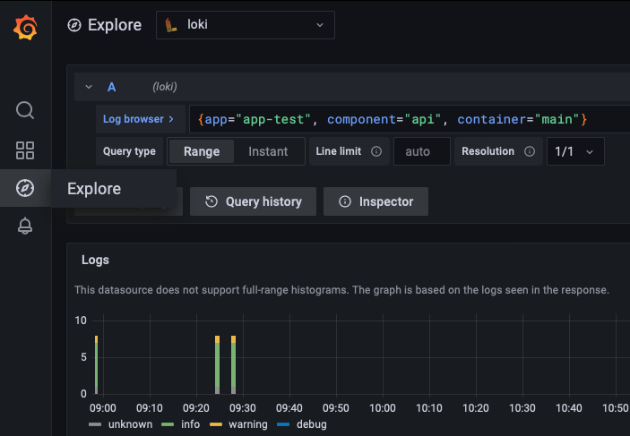
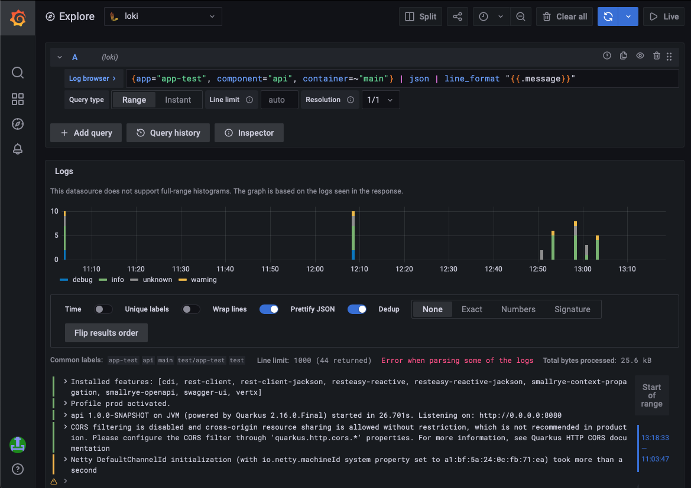
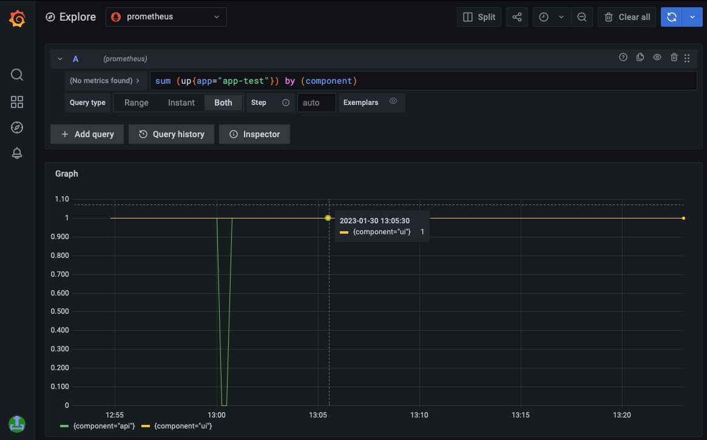

**Table of Contents**

<!-- START doctoc generated TOC please keep comment here to allow auto update -->
<!-- DON'T EDIT THIS SECTION, INSTEAD RE-RUN doctoc TO UPDATE -->

- [Telemetry](#telemetry)
  - [Logging](#logging)
    - [Search in Logs](#search-in-logs)
    - [Live Logs](#live-logs)
  - [Metrics](#metrics)
    - [Custom Metrics](#custom-metrics)
  - [ITSM Alerting](#itsm-alerting)
  - [Tracing](#tracing)

<!-- END doctoc generated TOC please keep comment here to allow auto update -->

# Telemetry

Telemetry data jointly refers to logs, metrics, traces and other diagnostic data of your app.

## Logging

Application logs can be accessed in Grafana:

* [Grafana int](https://unity-int.bmwgroup.net/grafana/)
* [Grafana](https://unity.bmwgroup.net/grafana/)

In the **Explore** tab, logs can be searched by selecting **Loki** as datasource.



### Search in Logs

Logs can be search using [LogQL](https://grafana.com/docs/loki/latest/logql/).



Here are a few examples to start with:

* Select logs for the `app-test`'s `api` component from the `main` container:
  ```
  {app="app-test", component="api", container="main"}
  ```
* Find logs containing the word `NullPointerException` in the logs
  ```
  {app="app-test", component="api", container="main"} |= `NullPointerException`
  ```
* Select logs for multiple containers:
  ```
  {app="app-test", component="api", container=~"main|authz|envoy"}
  ```
* Select logs by querying a json property (works with JSON logs only)
  ```
  {app="app-test", component="api", container=~"main"} | json | level="WARN"
  ```
* Print only part of a JSON log entry:
  ```
  {app="app-test", component="api", container=~"main"} | json | line_format "{{.message}}"
  ```

### Live Logs

To follow logs of an app's component, select the relevant logs by label and click the **Live** button, the logs will
update automatically.

<video autoplay loop width=801>
  <source src="../assets/live-logs.mov" type="video/mp4">
Your browser does not support the video tag.
</video>

## Metrics

Application metrics can be accessed in Grafana:

* [Grafana int](https://unity-int.bmwgroup.net/grafana/)
* [Grafana](https://unity.bmwgroup.net/grafana/)

In the **Explore** tab, metrics be explored by selecting **Prometheus** as datasource.



Metrics can be explored using [PromQL](https://prometheus.io/docs/prometheus/latest/querying/basics/).

Here are a few examples to start with:

* Select the `up` metric and sum by component:
  ```
  sum (up{app="app-test"}) by (component)
  ```
* Show absolute memory usage in MB
  ```
  avg(container_memory_working_set_bytes{pod=~"app-test-api-.*", container=~"main"}) by (pod, container) / 1e6
  ```
* Show memory usage relative to limits
  ```
  avg(container_memory_working_set_bytes{pod=~"app-test-api-.*", container=~"main"}) by (pod, container)
  / avg(kube_pod_container_resource_limits{pod=~"app-test-api-.*", container=~"main", resource="memory"} > 0) by (pod, container)
  ```
* Show memory usage relative to requests
  ```
  avg(container_memory_working_set_bytes{pod=~"app-test-api-.*", container=~"main"}) by (pod, container)
  / avg(kube_pod_container_resource_requests{pod=~"app-test-api-.*", container=~"main", resource="memory"} > 0) by (pod, container)
  ```

### Custom Metrics

If the application wants to monitor its own metrics, this can be done be defining the metrics endpoint as follows:

```yaml
deployments:
  api:
    container:
      metrics: /my-app/api/metrics
```

In this case the endpoint `/my-app/api/metrics` will be scraped and the exposed metrics can be explored as described
above. This endpoint will be available only from within the Kubernetes cluster.
It will not be possible to access the metrics endpoint via the ingress (for
example `https://unity.bmwgroup.net/my-app/api/metrics` will be forbidden).

Using a labeling where the cardinality of the value set is high (e.g. email address) can dramatically increase the
amount
of data stored (for more information please refer
to [Prometheus's official guide](https://prometheus.io/docs/practices/naming)).
Therefore, there are some limitations regarding the custom metrics to prevent overloading and killing the time series
database:

* The maximum number of labels per sample is 10
* The maximum number of samples per scrape is 200

## ITSM Alerting

It is possible to
define [Prometheus Alerting Rules](https://prometheus.io/docs/prometheus/latest/configuration/alerting_rules)
which can be configured to trigger incident creation. The prerequisite for this is a valid monitor contract ID (MCID)
which can be created in the [Application Monitoring Database](http://systemsmgmt-portal.bmwgroup.net).

An alert can then be configured as follows:

```yaml
appId: APP-1234
deployments:
  api:
    replicas: 1
    container:
    # Container configuration
alerts:
  foo_total:
    description: Foo_total has reached 10 for label 'prom-rule-test'.
    expr: foo_total{metric="prom-rule-test"} > 10
    for: 10m
    labels:
      # itsm_app_id: APP-789 # optional APP-ID from the MCID. Only required if different from the appId provided above
      itsm_contract_id: 10APP123456789 # your MCID from the Application Monitoring Database
      itsm_enabled: true
      itsm_event_id: foo_total_reached_10
      itsm_severity: MINOR
      severity: other
    summary: Foo_total is greater then 10
```

For more information regarding alerts integration please refer to
[4Wheels Managed](https://developer.bmwgroup.net/docs/4wheels-managed/applications_integration/monitoring/#alerts-integration)
documentation.

## Tracing

Tracing is not available yet.
