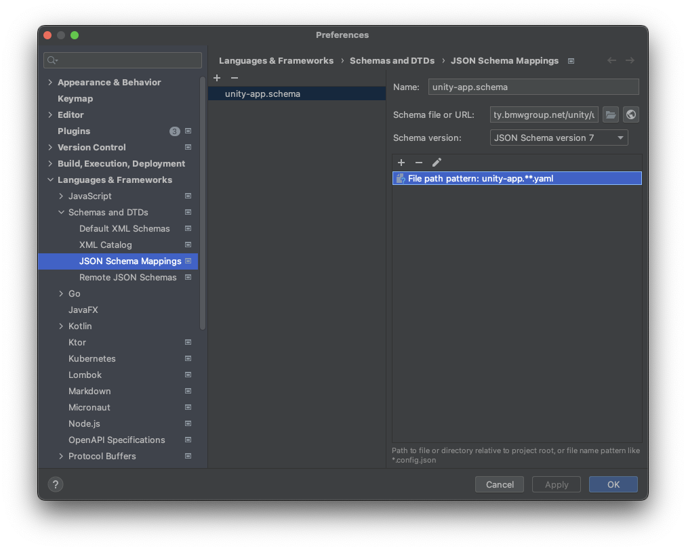

**Table of Contents**

<!-- START doctoc generated TOC please keep comment here to allow auto update -->
<!-- DON'T EDIT THIS SECTION, INSTEAD RE-RUN doctoc TO UPDATE -->

- [Unity App Yaml](#unity-app-yaml)
  - [IntelliJ and Other JetBrains IDEs](#intellij-and-other-jetbrains-ides)

<!-- END doctoc generated TOC please keep comment here to allow auto update -->

# Unity App Yaml

The `unity-app.*.yaml` files is the central point of interaction of a UNITY app and the platform.
Several files, one for each environment, specify the configuration of an app.

Bv default this is:

* `unity-app.int.yaml` for the integration environment.
* `unity-app.prod.yaml` for the production environment.

The schema for these files can be found
here: [https://unity.bmwgroup.net/unity/unity-app.schema.json](https://unity.bmwgroup.net/unity/unity-app.schema.json)

The schema does not only allow validation of the configuration, but also contains documentation of each property.

It is recommended to map the schema to the `unity-app.*.yaml` files in an IDE, as this will enable autocompletion and
inline documentation.

## IntelliJ and Other [JetBrains](https://www.jetbrains.com) IDEs

Enable JSON schema validation and autocompletion following the steps below:

* Open **Preferences** and go to **Language and Frameworks > Schemas and DTDs > JSON Schema Mappings**.
* Click on the **+** to add a new schema mapping.
* Fill the following fields
  * Name: **unit-app**
  * Schema File or URL: https://unity.bmwgroup.net/unity/unity-app.schema.json
  * Schema version: JSON Schema version 7
* click on the **+** below and set: File path pattern: **unity-app\*\*.yaml**
* Open e.g. the **unity-app.int.yaml** and hit Ctrl + Space to get autocompletion.

<video autoplay loop width=801>
  <source src="../assets/schema-autocompletion.mov" type="video/mp4">
Your browser does not support the video tag.
</video>

The final config looks as follows.

