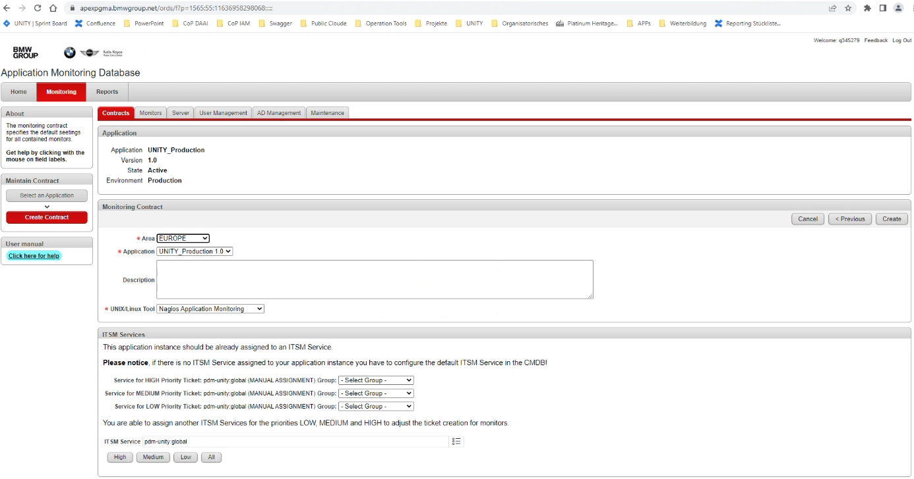

**Table of Contents**

<!-- START doctoc generated TOC please keep comment here to allow auto update -->
<!-- DON'T EDIT THIS SECTION, INSTEAD RE-RUN doctoc TO UPDATE -->

<!-- END doctoc generated TOC please keep comment here to allow auto update -->

# Setup Monitoring Contract

Setting up a monitoring contract can be done in the following self-service portal: http://systemsmgmt-portal.bmwgroup.net.
Only application operations managers are able to create monitoring contracts. An example request for creating a monitoring
contract can be seen in the following screenshot:

