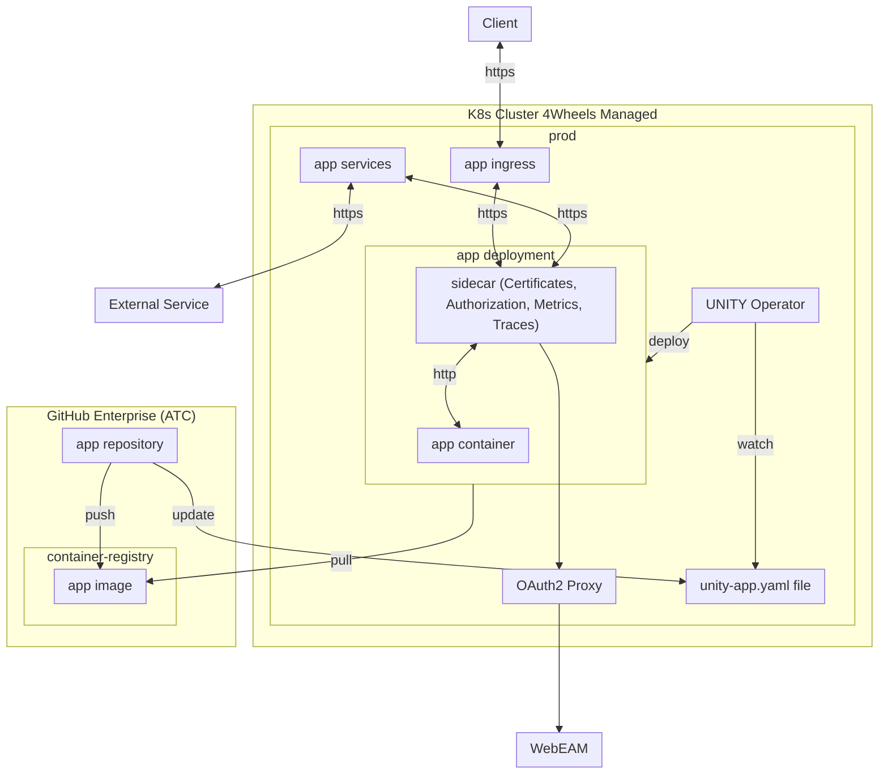

**Table of Contents**

<!-- START doctoc generated TOC please keep comment here to allow auto update -->
<!-- DON'T EDIT THIS SECTION, INSTEAD RE-RUN doctoc TO UPDATE -->

- [Architecture](#architecture)

<!-- END doctoc generated TOC please keep comment here to allow auto update -->

# Architecture

The following diagram gives an overview on the UNITY architecture.

There is only one `app repository`, `app image` and `app deployment` as an example in this diagram.
In reality, there are many different `app repositories` such as e.g. `app-foo`, `app-bar`, ...
In addition, from each repository, multiple images can be pushed to the container registry (e.g. `app-foo-ui`
and `app-foo-api`, ...) leading to multiple deployments.
For a more detailed diagram, see [Kubernetes](kubernetes.html).
