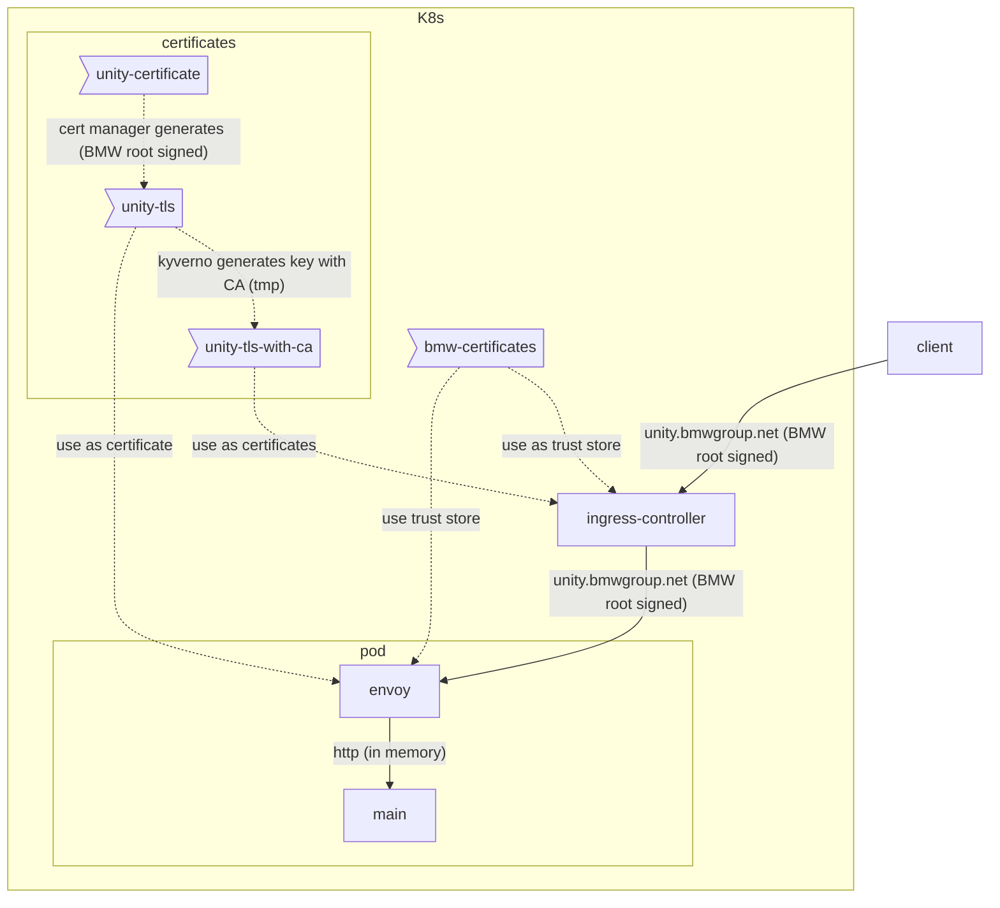

**Table of Contents**

<!-- START doctoc generated TOC please keep comment here to allow auto update -->
<!-- DON'T EDIT THIS SECTION, INSTEAD RE-RUN doctoc TO UPDATE -->

- [Certs](#certs)
  - [Architecture](#architecture)
  - [TLS](#tls)
  - [How to Inspect Certificates](#how-to-inspect-certificates)
  - [Client to Ingress Controller](#client-to-ingress-controller)
  - [Ingress Controller to Pod](#ingress-controller-to-pod)

<!-- END doctoc generated TOC please keep comment here to allow auto update -->

# Certs

Unity does all certificate handling for an app. This means an app developer may develop an entire back-end without
ever needing to touch a certificate or trust store.

## Architecture

In UNITY all HTTP traffic is encrypted via TLS. Encryption is handled by different certificates, as outlined below:

* Client to ingress controller
* Ingress controller to Pod



The sections below outline the details.

## TLS

When an end-user opens a UNITY app's UI in the web browser, they call an URL like `https://unity.bmwgroup.net/foo/ui`.
The request is handled by the ingress controller of the Kubernetes cluster, which also terminates TLS.

The ingress controller is configured via
an [`Ingress`](https://kubernetes.io/docs/concepts/services-networking/ingress/) object, configured via the
[unity-app](https://atc-github.azure.cloud.bmw/UNITY/unity-helm-charts/tree/main/charts/unity-app) Helm chart.

The [nginx ingress controller](https://github.com/kubernetes/ingress-nginx) can be configured
via [annotations](https://github.com/kubernetes/ingress-nginx/blob/main/docs/user-guide/nginx-configuration/annotations.md)
to handle TLS correctly.

All ingress objects MUST have the following annotations set:

```yaml
nginx.ingress.kubernetes.io/backend-protocol: HTTPS
nginx.ingress.kubernetes.io/proxy-ssl-name: "<service name>.<namespace>.svc.cluster.local"
nginx.ingress.kubernetes.io/proxy-ssl-secret: "<namespace>/<secret name>"
nginx.ingress.kubernetes.io/proxy-ssl-verify: "on"
```

These annotations make sure TLS is terminated by the ingress controller and re-encrypted on the upstream.
To terminate TLS using a certificate that is signed by a BMW certificate authority,
the [cert-manager](https://cert-manager.io) is employed.

The cert manager handles a [`Certificate`](https://cert-manager.io/docs/usage/certificate/) CRD, which instructs the
cert manager to generate a certificate and store it in a secret.

Then a kyverno policy creates another secret that contains where the CA certificate is appended.
This method is temporary used by 4Wheels Managed
to [serve intermediate certificates](https://developer.bmwgroup.net/docs/4wheels-managed/applications_integration/certificates/#serve-intermediate-certificates)

Additional info can be found in
the [Certificates](https://developer.bmwgroup.net/docs/4wheels-managed/applications_integration/certificates/)
documentation.

Upstream traffic from the ingress controller to the pod (envoy) is handled by bmw certificates which are pushed to envoy from sds servers.

Since the cert manager may generate a new certificate at a certain
point in time, to make sure that the new key is handled correctly by the pods mounting the key we use
envoy [Secret discovery service](https://www.envoyproxy.io/docs/envoy/latest/configuration/security/secret).
With SDS, a central SDS server will push certificates to all Envoy instances. If certificates are expired, the server
just pushes new certificates to Envoy instances, Envoy will use the new ones right away without re-deployment.

In the pod, TLS is terminated by an [envoy proxy](https://www.envoyproxy.io).
Configuration of the envoy proxy is part of the
[unity-app](https://atc-github.azure.cloud.bmw/UNITY/unity-helm-charts/tree/main/charts/unity-app) Helm chart as well.
Finally, the envoy proxy passes traffic on to the app's main container within the pod without encryption via HTTP.
By terminating TLS on the envoy, the app's main container does not need to handle any certificates or secrets.

## How to Inspect Certificates

The certificates can be inspected locally as follows.

## Client to Ingress Controller

To inspect the client to ingress controller certificate, one would need to run the following scripts:

```bash
kubectl get certificate -oyaml unity-certificate
```

The certificates can be dumped from the secret where the cert manager places them as follows.

```bash
kubectl get secrets unity-tls -ojson | jq '.data["tls.crt"] | @base64d' -r
kubectl get secrets unity-tls-with-ca -ojson | jq '.data["tls.crt"] | @base64d' -r
```

## Ingress Controller to Pod

TLS from the ingress controller to the service (pod) is handled by the same certificate and the same store, served by
sds servers.

It needs to be made sure that the pod is serving traffic with the certificate from the secret (and not using an
outdated certificate).
This can be done by mapping the port of the service to localhost

```bash
NAME=<name of the app, e.g. services>
DEPLOYMENT=<name of the deployment, e.g. api>

kubectl port-forward svc/app-$NAME-$DEPLOYMENT 8000:8000
```

Then, in a separate shell connect to the mapped port and dump the served certificate:

```bash
openssl s_client -showcerts -connect localhost:8000 -servername app-$NAME-$DEPLOYMENT </dev/null 2>/dev/null
```

Make sure the served certificate is that same as the one from secret:

```bash
kubectl get secret unity-tls -oyaml | yq -r '.data["tls.crt"]' | base64 -D
```

We have an option to mount the trust store to the main container (.container.bmwCertificatesMountPath option from app yaml file).
The ingress controller should trust this certificate, which is configured in the following annotation:

```bash
kubectl get ingress app-$NAME-$DEPLOYMENT -ojson | jq -r '.metadata.annotations["nginx.ingress.kubernetes.io/proxy-ssl-secret"]'
```

It is also crucial that `nginx.ingress.kubernetes.io/proxy-ssl-verify` is set to `on`
and `nginx.ingress.kubernetes.io/proxy-ssl-name` is set to a value in the certificate. This can be validated with:

```bash
SNI=$(kubectl get ingress app-$NAME-$DEPLOYMENT -ojson | jq -r '.metadata.annotations["nginx.ingress.kubernetes.io/proxy-ssl-name"]')
cat svc-tls.crt | openssl x509 -noout -text -certopt no_header,no_version,no_serial,no_signame,no_issuer,no_pubkey,no_sigdump,no_aux | grep $SNI
```

Finally, it may still be possible, that one of the pods backing the service is serving the correct certificate and
another one does not. To make sure, map the port of the individual pods instead of mapping the service port and repeat
the certificate validation.
