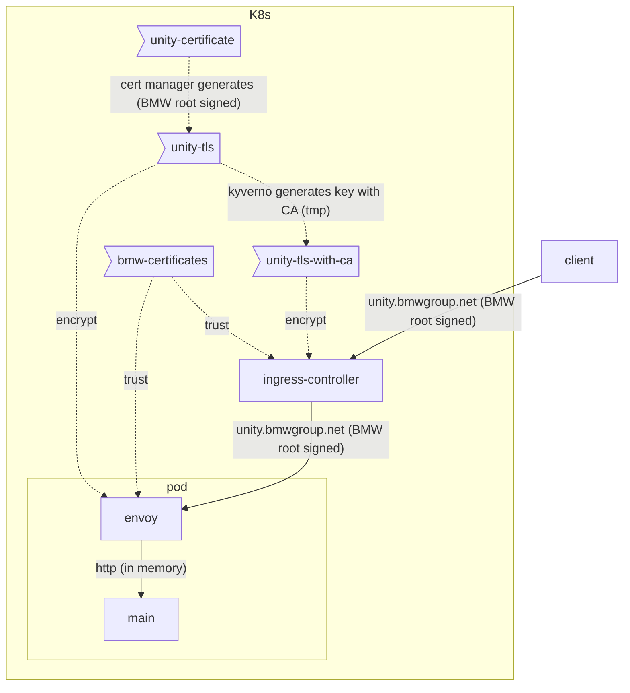
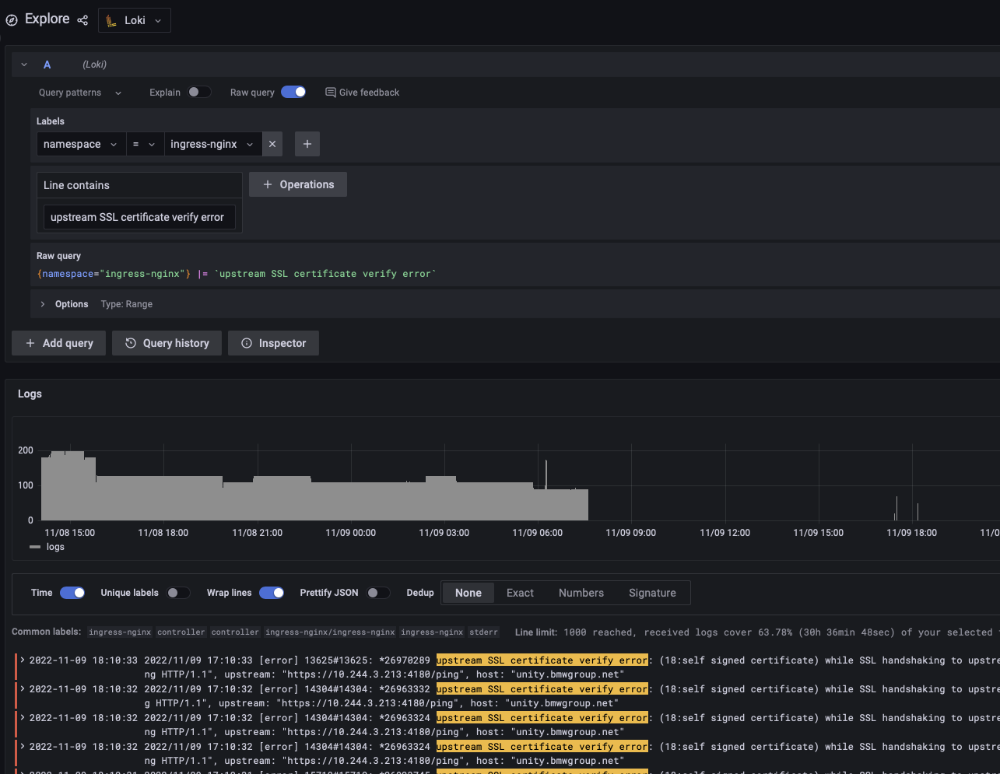

**Table of Contents**

<!-- START doctoc generated TOC please keep comment here to allow auto update -->
<!-- DON'T EDIT THIS SECTION, INSTEAD RE-RUN doctoc TO UPDATE -->

- [Certs](#certs)
  - [Architecture](#architecture)
  - [TLS](#tls)
  - [How to Inspect Certificates](#how-to-inspect-certificates)
  - [Client to Ingress Controller](#client-to-ingress-controller)
  - [Ingress Controller to Pod](#ingress-controller-to-pod)

<!-- END doctoc generated TOC please keep comment here to allow auto update -->

# Certs

Unity handles all certificate management for an app. This means that app developers can develop an entire backend
without ever needing to touch a certificate or trust store.

## Architecture

In UNITY, all HTTP traffic is encrypted using TLS. Encryption is handled by different certificates, as outlined below:

* Client to ingress controller
* Ingress controller to Pod



The sections below outline the details.

## TLS

When an end-user opens a UNITY app's UI in the web browser,
they call a URL like `https://unity.bmwgroup.net/foo/ui`.
The request is handled by the ingress controller of the Kubernetes cluster, which also terminates TLS.

The ingress controller is configured via
an [`Ingress`](https://kubernetes.io/docs/concepts/services-networking/ingress/) object, configured via the
[unity-app](https://atc-github.azure.cloud.bmw/UNITY/unity-helm-charts/tree/main/charts/unity-app) Helm chart.

The [nginx ingress controller](https://github.com/kubernetes/ingress-nginx) can be configured
via [annotations](https://github.com/kubernetes/ingress-nginx/blob/main/docs/user-guide/nginx-configuration/annotations.md)
to handle TLS correctly.

All ingress objects MUST have the following annotations set:

```yaml
nginx.ingress.kubernetes.io/backend-protocol: HTTPS
nginx.ingress.kubernetes.io/proxy-ssl-name: "<service name>.<namespace>.svc.cluster.local"
nginx.ingress.kubernetes.io/proxy-ssl-secret: "<namespace>/<secret name>"
nginx.ingress.kubernetes.io/proxy-ssl-verify: "on"
```

These annotations ensure that TLS is terminated by the ingress controller and re-encrypted on the upstream.
To terminate TLS using a certificate that is signed by a BMW certificate authority,
the [cert-manager](https://cert-manager.io) is employed.

The cert manager handles a [`Certificate`](https://cert-manager.io/docs/usage/certificate/) CRD, which instructs the
cert manager to generate a certificate and store it in a secret.

Then a [Kyverno policy](https://kyverno.io/policies/) creates another secret that contains the generated server
certificate as well as the intermediate CA. This is a temporary solution by 4Wheels Managed
to [serve intermediate certificates](https://developer.bmwgroup.net/docs/4wheels-managed/applications_integration/certificates/#serve-intermediate-certificates)

Additional infoformation can be found in
the [Certificates](https://developer.bmwgroup.net/docs/4wheels-managed/applications_integration/certificates/)
documentation.

Upstream traffic from the ingress controller to the pod (Envoy) is also handled by BMW signed certificates.
In the pod, TLS is terminated by an [envoy proxy](https://www.envoyproxy.io).

Envoy's [Secret Discovery Service (SDS)](https://www.envoyproxy.io/docs/envoy/latest/configuration/security/secret#example-three-certificate-rotation-for-xds-grpc-connection)
automatically picks up new certificates, whenever the content of the mounted secret changes, without restarting the Envoy
container. This ensures that certificates can be rotated without restarting any containers or pods.

The configuration of the Envoy proxy is also part of the
[unity-app](https://atc-github.azure.cloud.bmw/UNITY/unity-helm-charts/tree/main/charts/unity-app) Helm chart.
Finally, the Envoy proxy passes traffic to the app's main container within the pod without encryption via HTTP.
By terminating TLS at the Envoy, the app's main container does not need to handle any certificates or secrets.

## How to Inspect Certificates

When something breaks, it is important to know how to inspect the various certificates.

If the ingress controller stops serving traffic, one possible reason could be an issue with the certificate configuration.
The first step for troubleshooting should be inspecting the logs in Grafana Loki:



Next, the certificates can be inspected locally as follows.

## Client to Ingress Controller

To inspect the client to ingress controller certificate, you would need to run the following scripts:

```bash
kubectl get certificate -oyaml unity-certificate
```

The certificates can be extracted from the secret where the cert manager stores them using the following commands:

```bash
kubectl get secrets unity-tls -ojson | jq '.data["tls.key"] | @base64d' -r > tls.key
kubectl get secrets unity-tls -ojson | jq '.data["tls.crt"] | @base64d' -r > tls.crt

kubectl get secrets unity-tls-with-ca -ojson | jq '.data["tls.crt"] | @base64d' -r > tls-with-ca.crt
```

Using `openssl`, you can display the contents of the certificate:

```bash
cat tls.crt | openssl x509 -noout -text -certopt no_header,no_version,no_serial,no_signame,no_issuer,no_pubkey,no_sigdump,no_aux
```

To validate whether a certificate key and crt match, you can compare the checksums using the following commands:

```bash
CRT_MD5=$(openssl x509 -noout -modulus -in tls.crt | openssl md5)
KEY_MD5=$(openssl rsa -noout -modulus -in tls.key | openssl md5)
echo $CRT_MD5
echo $KEY_MD5
echo "diff:"
diff <(echo "$CRT_MD5") <(echo "$KEY_MD5")
```

If the checksums are equal (the diff is empty), the pair is valid.

## Ingress Controller to Pod

TLS from the ingress controller to the service (pod) is handled by the same certificate.

To ensure that the pod is serving traffic with the certificate from the secret (and not using an outdated certificate,
e.g. after the certificate was rotated to a new one), you can map the port of the service to localhost using the
following command:

```bash
NAME=<name of the app, e.g. services>
DEPLOYMENT=<name of the deployment, e.g. api>

kubectl port-forward svc/app-$NAME-$DEPLOYMENT 8000:8000
```

Then, in a separate shell, you can connect to the mapped port and dump the served certificate:

```bash
openssl s_client -showcerts -connect localhost:8000 -servername app-$NAME-$DEPLOYMENT </dev/null 2>/dev/null
```

Make sure the served certificate is the same as the one from the secret:

```bash
kubectl get secret unity-tls -ojson | jq -r '.data["tls.crt"] | @base64d'
```

The ingress controller should trust this certificate, which is configured in the following annotation:

```bash
kubectl get ingress app-$NAME-$DEPLOYMENT -ojson | jq -r '.metadata.annotations["nginx.ingress.kubernetes.io/proxy-ssl-secret"]'
```

It is also crucial that `nginx.ingress.kubernetes.io/proxy-ssl-verify` is set to `on`
and `nginx.ingress.kubernetes.io/proxy-ssl-name` is set to a value in the certificate.
You can validate this with the following command:

```bash
SNI=$(kubectl get ingress app-$NAME-$DEPLOYMENT -ojson | jq -r '.metadata.annotations["nginx.ingress.kubernetes.io/proxy-ssl-name"]')
cat svc-tls.crt | openssl x509 -noout -text -certopt no_header,no_version,no_serial,no_signame,no_issuer,no_pubkey,no_sigdump,no_aux | grep $SNI
```

Finally, it may still be possible that one of the pods backing the service is serving the correct certificate while
another one does not. To ensure this, map the port of the individual pods instead of mapping the service port and repeat
the certificate validation.

