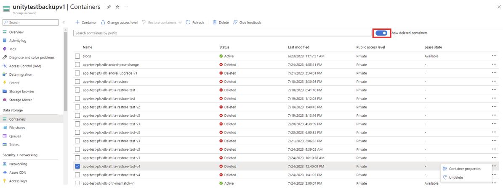
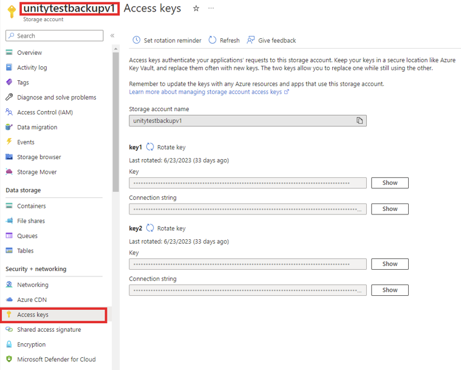
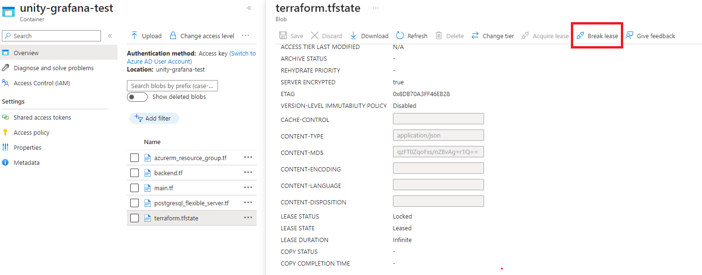
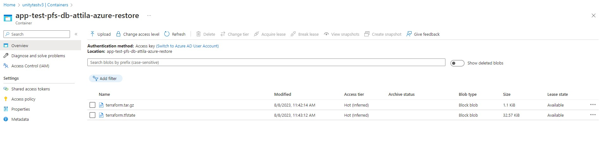

**Table of Contents**

<!-- START doctoc generated TOC please keep comment here to allow auto update -->
<!-- DON'T EDIT THIS SECTION, INSTEAD RE-RUN doctoc TO UPDATE -->

- [Database Incident Recovery](#database-incident-recovery)
  - [Restore Database Manually](#restore-database-manually)
  - [Fix Terraform Locked State](#fix-terraform-locked-state)
  - [Cleanup Resources When Destroy Is Interrupted](#cleanup-resources-when-destroy-is-interrupted)
  - [Manually Run Terraform Destroy From Local](#manually-run-terraform-destroy-from-local)
  - [Manually Delete Database Resources](#manually-delete-database-resources)

<!-- END doctoc generated TOC please keep comment here to allow auto update -->

# Database Incident Recovery

The sections below describe certain incidents related to databases and how to recover from them.

## Restore Database Manually

In case a manual restore of the database server is needed (e.g. the server was accidentally deleted) it can be done by
following these steps:

1. Recreate the azure resources for the database server through the `unity-app.*.yaml` with the exact same configuration.
You can get the last configuration from the git history of the `unity-app.*.yaml` file. Alternatively you can undelete
the container of the database in the azure portal, this should also contain the required configuration(⚠️In this case
don't forget to delete the container again before recreating the resources).
2. In the backup storage account (azure portal): delete the newly created blob container and undelete the container
containing the backup to be restored (⚠️check the last modified timestamps, the names will be the same).

3. Create a secret with one of the access keys of the backup storage account. This secret will be used to mount the
azure file share containing the backup in the container to later restore it.

    

    ```yaml
    apiVersion: v1
    kind: Secret
    metadata:
      name: app-test-pfs-db-foo-storage-account
      namespace: test
    stringData:
      azurestorageaccountname: unitytestbackupv1 # the name of the storage account containing the backups
      azurestorageaccountkey: unitytestbackupv1_acceskey # one of the access keys to the storage account containing the backups
    type: Opaque
    ```

4. Create a job to restore the DB Server. The job has two steps, first the `initContainer` copies the backup from
the blob container to the azure file share then the backup will be restored into the database server created in the first step.

    In the following example you can replace all the occurrences of `app-test-pfs-db-foo` with your database name.
  Every credential and certificate required is saved in the [keepass repo](https://atc-github.azure.cloud.bmw/UNITY/keepass),
  or you can run the [store-secrets](https://atc-github.azure.cloud.bmw/UNITY/unity-terraform/actions/workflows/store-secrets.yaml)
  workflow in the `unity-terraform` repo to get them. The Service Principle certificate can be encoded in `base64` using any
  linux terminal (e.g. in GitBash `cat /path/to/certificate | base64`). ️The container image must contain the
  [`psql`](https://www.postgresql.org/docs/current/app-psql.html) with the postgres version specified in step 1.

    ```yaml
    apiVersion: batch/v1
    kind: Job
    metadata:
      name: app-test-pfs-db-foo-restore-backup
      namespace: test
      labels:
        unity.bmwgroup.net/restore-database-backup: "app-test-pfs-db-foo"
    spec:
      template:
        spec:
          initContainers:
          - args:
            - -c
            - echo $AZURE_CLIENT_CERT_PFX_B64 | base64 -d > $AZCOPY_SPA_CERT_PATH;
              mkdir /backupfileshare/app-test-pfs-db-foo;
              azcopy copy "https://unitytestbackupv1.blob.core.windows.net/app-test-pfs-db-foo/app-test-pfs-db-foo.tar" /backupfileshare/app-test-pfs-db-foo;
            command:
            - sh
            env:
            - name: AZCOPY_AUTO_LOGIN_TYPE
              value: SPN
            - name: AZCOPY_TENANT_ID
              value: tenant-id # the azure tenant id
            - name: AZCOPY_SPA_CERT_PATH
              value: /tmp/cert.pfx
            - name: AZCOPY_SPA_APPLICATION_ID
              value: application-id # the client id of the service principal
            - name: AZCOPY_LOG_LOCATION
              value: /tmp
            - name: AZCOPY_JOB_PLAN_LOCATION
              value: /tmp
            - name: AZURE_CLIENT_CERT_PFX_B64
              value: client-certificate # the certificate to the SP base64 encoded
            image: containers.atc-github.azure.cloud.bmw/unity/azcopy:2023-07-04t082112z-52b72fd # the latest azcopy image
            name: blob-to-fileshare
            resources:
              limits:
                cpu: 500m
                memory: 512Mi
              requests:
                cpu: 200m
                memory: 256Mi
            securityContext:
              allowPrivilegeEscalation: false
              capabilities:
                drop:
                - ALL
              readOnlyRootFilesystem: false
            volumeMounts:
            - mountPath: /backupfileshare
              name: backupfileshare
          imagePullSecrets:
          - name: containers.atc-github.azure.cloud.bmw
          containers:
          - args:
            - -c
            - |
              set -eux
              cd /backupfileshare/db-foo
              tar -xvmpf db-foo.tar
              gzip -d -c backup-all.gz > backup-all.out
              psql -f backup-all.out postgres
              rm backup-all.gz
              rm backup-all.out
              gzip -d -c backup-postgres.gz > backup-postgres.out
              psql -f backup-postgres.out postgres
              rm backup-postgres.gz
              rm backup-postgres.out
            command:
            - bash
            env:
            - name: PGHOST
              value: app-test-pfs-db-foo.postgres.database.azure.com
            - name: PGUSER
              value: postgres # the postgres admin
            - name: PGPASSWORD
              value: password # the admin password
            image: postgres:14 # the image must contain the required postgres version
            name: restore
            resources:
              limits:
                cpu: 500m
                memory: 512Mi
              requests:
                cpu: 200m
                memory: 256Mi
            securityContext:
              allowPrivilegeEscalation: false
              capabilities:
                drop:
                - ALL
              readOnlyRootFilesystem: false
            volumeMounts:
            - mountPath: /backupfileshare
              name: backupfileshare
          restartPolicy: OnFailure
          securityContext:
            runAsNonRoot: true
            runAsUser: 10000
            runAsGroup: 10000
            seccompProfile:
              type: RuntimeDefault
          volumes:
          - csi:
              driver: file.csi.azure.com
              volumeAttributes:
                secretName: app-test-pfs-db-foo-storage-account # the name of the secret from step 3
                shareName: app-test-pfs-db-foo
            name: backupfileshare
      ttlSecondsAfterFinished: 86400
    ```

    ⚠️It's important to add the `unity.bmwgroup.net/restore-database-backup` label with the proper value (`<app-name>-pfs-<database-server-name>`),
this will prevent the operator to execute any update on the database during the restore process.

    ⚠️Also please note that when trying to restore a large database, it might be necessary to increase the resources
(of both the initContainer and the main container).

5. After the job is done verify the logs in grafana. It is possible that there are some errors related to database objects
managed by azure and/or the default `postgres` database, because the postgres admin user is not a superuser, to whom azure does
not give access. If there isn't any error related to the database(s) managed by the application and the restore was successful
delete the secret created in step 3.

## Fix Terraform Locked State

Sometimes it might happen that all terraform operations fail because of being in a locked state. There are two possibilities
to recover from this situation:

- via the Azure portal UI, the lease can be broken:
  

- by running the Terraform command `force-unlock`
```bash
azcopy login
azcopy copy https://unitytestv3.blob.core.windows.net/unity-grafana-test . --recursive
cd unity-grafana-test
terraform force-unlock <LOCK_ID>
```

## Cleanup Resources When Destroy Is Interrupted

There are cases when the database destroy operation is interrupted for various reasons.
The most common reason is when the unity operator is restarted while destroy operation was in progress.

Steps to follow:
* Check to see if the database container is in a locked stated and if its unlock it,
  see: [Fix Terraform Locked State](#fix-terraform-locked-state)
* If the secret do not exist, add secret of type `postgresql-flexible-server/destroy` manually for that database, e.g.:
```bash
# Make sure you adapt the names accordingly
kubectl apply -f - <<EOF
apiVersion: v1
kind: Secret
metadata:
  annotations:
    unity-operator.unity.bmwgroup.net/azure-resource-group-name: app-test
    unity-operator.unity.bmwgroup.net/disabled: "false"
  labels:
    app.kubernetes.io/managed-by: unity
    app.kubernetes.io/name: app-test-pfs-db-attila-azure-restore-v3-manually-added
    unity-operator.unity.bmwgroup.net/postgresql-flexible-server-secret-name: app-test-pfs-db-attila-azure-restore-v3
  name: app-test-pfs-db-attila-azure-restore-v3-manually-added
  namespace: test
type: postgresql-flexible-server/destroy
EOF
```
and if the secret exists, just edit the secret, e.g. add a random label, to trigger the reconciliation loop.
* Checkout unity-operator logs to see if destroy was done with success.
  If not, delete the secret manually, fix the issue from logs (if you can) and repeat the process
* If you get an error message like:
```bash
Job 110449 failed with\nstatus: 500 and message: \"ERROR : A problem occurred. - Failed to perform\n'read' on resource(s) of type 'privateDnsZones/virtualNetworkLinks'
```
just edit the secret again, add a random label to trigger the reconciliation loop again (you might get lucky).
This is an error message coming from [https://manage.azure.bmw.cloud/](https://manage.azure.bmw.cloud/).
If the job still fails, open an incident to `public-cloud-framework:global`
* If the above steps did not work, follow [Manually Run Terraform Destroy From Local](#manually-run-terraform-destroy-from-local)

## Manually Run Terraform Destroy From Local

In some cases the automatic destroy fails without being interrupted, for example: When someone creates a new DB server with an invalid configuration (e.g. too early PITR time stamp).
Terraform will not be able to create the Server. When trying to delete that DB server,
the destroy change request will fail, because the backup job cannot be executed,
because there is no fqdn in the terraform output,
e.g. error: `"could not read outputs: terraform output empty for \"fqdn\""`.

Steps to follow:
* Download terraform files from db related container, e.g.
  
* Unzip terraform files
* Run `terraform init`
* Run `terraform destroy`

If the above steps do not succeed you should follow [Manually Delete Database Resources](#manually-delete-database-resources)

## Manually Delete Database Resources

When you are in a state where the automatic or semi-automatic ways do not succeed,
you will need to delete the resources manually.

To do so, first you need to check if you can see the Private DNS zones and VNETs
used by your db server in [https://manage.azure.bmw.cloud/](https://manage.azure.bmw.cloud/) and if you see them, delete them from there,
if not delete them from [https://portal.azure.com/](https://portal.azure.com/).

Steps to delete a VNET:
1. Identify the VNET from `Azure Database for PostgreSQL flexible server` view resource in [https://portal.azure.com/](https://portal.azure.com/)
 -> Networking tab -> Virtual network section
2. Make sure the VNET in question is delegated to `Microsoft.DBforPostgreSQL/flexibleServers`.
You can see that in VNET view screen from [https://portal.azure.com/](https://portal.azure.com/), Subnets tab
3. Edit VNET, set Delegation to None.
4. Delete the VNET from [https://manage.azure.bmw.cloud/](https://manage.azure.bmw.cloud/) -> Network -> Manage Existing Networks
5. If you cannot find the VNET in the above step, delete it directly from [https://portal.azure.com/](https://portal.azure.com/)

If the VNET exists in [https://manage.azure.bmw.cloud/](https://manage.azure.bmw.cloud/)
but it doesn't exist in [https://portal.azure.com/](https://portal.azure.com/)
you should open an ITSM ticket to `public-cloud-framework:global`

Steps to delete a Private DNS Zone:
1. Identify the Private DNS Zone in [https://portal.azure.com/](https://portal.azure.com/)
2. Delete all Virtual network links from that Private DNS Zone from [https://portal.azure.com/](https://portal.azure.com/) vew screen
3. Delete the Private DNS Zone from [https://manage.azure.bmw.cloud/](https://manage.azure.bmw.cloud/) -> DNS -> Manage Private DNS Zones tab
4. If you cannot find the Private DNS Zone in the above step, delete it directly from [https://portal.azure.com/](https://portal.azure.com/)

If the Private DNS Zone exists in [https://manage.azure.bmw.cloud/](https://manage.azure.bmw.cloud/)
but it doesn't exist in [https://portal.azure.com/](https://portal.azure.com/)
you should open an ITSM ticket to `public-cloud-framework:global`

The remaining resources will be deleted from [https://portal.azure.com/](https://portal.azure.com/)
