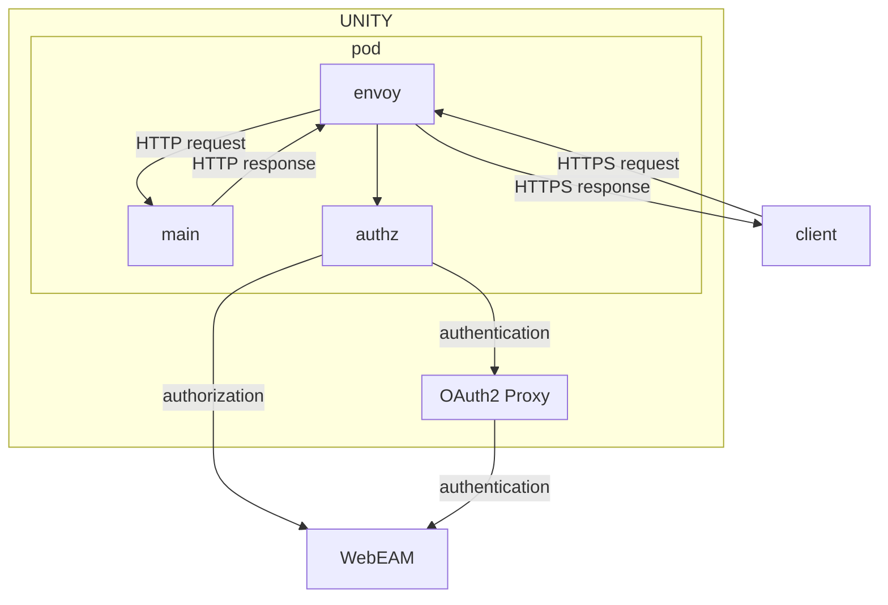

**Table of Contents**

<!-- START doctoc generated TOC please keep comment here to allow auto update -->
<!-- DON'T EDIT THIS SECTION, INSTEAD RE-RUN doctoc TO UPDATE -->

- [Envoy](#envoy)
  - [Architecture](#architecture)
    - [Authorization](#authorization)
    - [Content Encoding](#content-encoding)
    - [TLS Termination](#tls-termination)
    - [Accessing the Kubernetes API](#accessing-the-kubernetes-api)
  - [Testing Locally](#testing-locally)

<!-- END doctoc generated TOC please keep comment here to allow auto update -->

# Envoy

[Envoy proxy](https://www.envoyproxy.io) is used in UNITY to proxy all traffic going in and out of the app's main
container by following the service mesh pattern.

The config for envoy is part of
the [unity-app](https://atc-github.azure.cloud.bmw/UNITY/unity-helm-charts/tree/main/charts/unity-app) Helm chart.

## Architecture

The basic idea of a service mesh is to offload some logic from the application's container to a sidecar. Typically,
authorization, TLS, content encoding, metrics and other things are handled by a sidecar.
In UNITY, an app is deployed with some sidecars, one of them being an envoy proxy as shown in the diagram below:



The subsections below detail some aspects the envoy proxy is handling.

### Authorization

All traffic to a pod is handled by the envoy proxy. This is enforced via
a [`NetworkPolicy`](https://kubernetes.io/docs/concepts/services-networking/network-policies/).

The network policy makes is part of the
[unity-app](https://atc-github.azure.cloud.bmw/UNITY/unity-helm-charts/tree/main/charts/unity-app) Helm chart
and makes sure that only one port can receive traffic:

```yaml
apiVersion: networking.k8s.io/v1
kind: NetworkPolicy
metadata:
# ...
spec:
  egress:
    - { }
  ingress:
    - ports:
        - port: 8000
          protocol: TCP
  podSelector:
    matchLabels:
    # ...
  policyTypes:
    - Ingress
    - Egress
```

Since the envoy proxy is listening to the exposed port, it can safely handle authorization. This is done via the
[External Authorization](https://www.envoyproxy.io/docs/envoy/latest/configuration/http/http_filters/ext_authz_filter#external-authorization)
feature. Basically, envoy calls a webservice for every request to determine if a request is authorized.
Only if the external authorization service is authorizing the request, it passed on upstream to the main container.

In a UNITY app, the authorization service is implemented in the [authz](https://atc-github.azure.cloud.bmw/UNITY/authz)
service, which runs as a second sidecar container.
This sidecar can be configured for each UNITY app, individually.

For example, an OAuth2 flow to WebEAM may be initiated for unauthorized requests or certain roles should be checked by
the sidecar. Here is an example configuration:

```yaml
apiVersion: v1beta1
name: foo
deployments:
  ui:
    replicas: 1
    container:
      image: app-foo-ui
      tag: latest
    auth:
      oauth2:
        enabled: true
      roles:
        b2x:
          any:
            - PMD
            - B2B_I
```

### Content Encoding

For large request payloads, it makes sense to
enable [content-encoding](https://developer.mozilla.org/en-US/docs/Web/HTTP/Headers/Content-Encoding), e.g. based on
gzip. Instead of handling this in the application containers, the envoy proxy
[compresses and decompresses](https://www.envoyproxy.io/docs/envoy/latest/start/sandboxes/gzip.html) payloads.

### TLS Termination

TLS is terminated by the envoy proxy for inbound traffic as well as for outbound traffic.
This means, an app's main container does not need to enable TLS to serve requests and can simply serve traffic using
simple HTTP without TLS.
In addition, the app's main container does not need to maintain a trust store to connect to other services in a secure
way when calling services through the envoy proxy.

All this is configured in the
[unity-app](https://atc-github.azure.cloud.bmw/UNITY/unity-helm-charts/tree/main/charts/unity-app) Helm chart.

Read more about it in [Securing Envoy](https://www.envoyproxy.io/docs/envoy/latest/start/quick-start/securing.html).

### Accessing the Kubernetes API

It is possible to access the [Kubernetes API](https://kubernetes.io/docs/reference/kubernetes-api/) from an application
by sending a request to `http://localhost:8011/<path_to_resource>`. The reason for this is to provide information about
the k8s cluster to the applications managed by the platform.

The following request sent from the main container of an app returns the secret `app-test` from the namespace `int`:

```bash
curl http://localhost:8011/api/v1/namespaces/int/secrets/app-test
```

Note that in order to have access to a given resource, you must configure the necessary
[RBAC](https://kubernetes.io/docs/reference/access-authn-authz/rbac/) objects.

## Testing Locally

The simplest setup is to run envoy as docker container locally using `docker` or `podman`.
Alternatively, it is also possible to install envoy directly on the machine by following
the [official docs](https://www.envoyproxy.io/docs/envoy/latest/start/install).

Since the config would require adjustments when running envoy outside a container, the following steps will show how to
run envoy locally in a container only.

To run the same config as in a pod of an app, set the config of an app to analyze by defining the following env
variables.

```bash
NAME=<name of the app, e.g. services>
DEPLOYMENT=<name of the deployment, e.g. api>
```

Next, create a local tmp folder and dump the envoy config to a file.

```bash
kubectl get secret app-$NAME-$DEPLOYMENT-tls -ojson | jq -r '.data["tls.crt"] | @base64d'  > tls.crt
kubectl get secret app-$NAME-$DEPLOYMENT-tls -ojson | jq -r '.data["tls.key"] | @base64d'  > tls.key
kubectl get secret app-$NAME-bmw-certificates -ojson | jq -r '.data["ca.crt"] | @base64d'  > ca.crt
kubectl get cm app-$NAME-$DEPLOYMENT-envoy-config -ojson | jq -r '.data["config.yaml"]' > config.yaml
```

Now run envoy (use `docker` instead of `podman` if you prefer docker).

```bash
podman run \
  --mount type=bind,src=$(pwd)/ca.crt,target=/var/run/secrets/unity.bmwgroup.net/ca/ca.crt \
  --mount type=bind,src=$(pwd)/tls.crt,target=/var/run/secrets/unity.bmwgroup.net/tls/tls.crt \
  --mount type=bind,src=$(pwd)/tls.key,target=/var/run/secrets/unity.bmwgroup.net/tls/tls.key \
  --mount type=bind,src=$(pwd)/config.yaml,target=/var/run/secrets/unity.bmwgroup.net/envoy/config.yaml \
  --env ENVOY_UID=0 \
  -p 8000-8079:8000-8079 \
  docker.io/envoyproxy/envoy:v1.24.0 \
  -c /var/run/secrets/unity.bmwgroup.net/envoy/config.yaml \
  --log-level debug
```

Open the admin console in the local browser: [http://localhost:8001](http://localhost:8001).
Or try with curl:

```bash
curl http://localhost:8002/oauth2-proxy/ping
```

This should respond with `OK`.

Note that with this config, it is not possible to use envoy to proxy to a locally running app or the
[authz](https://atc-github.azure.cloud.bmw/UNITY/authz) service. This would require to map the localhost ports into
the container, which is not trivial.

