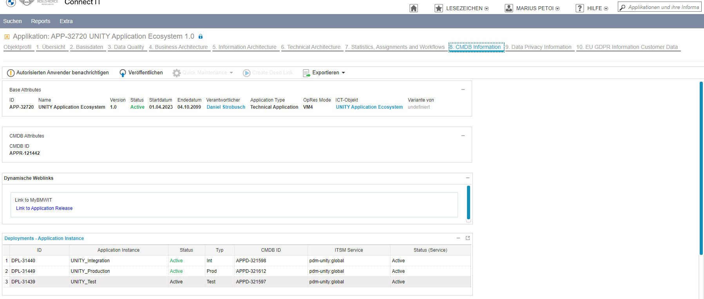

**Table of Contents**

<!-- START doctoc generated TOC please keep comment here to allow auto update -->
<!-- DON'T EDIT THIS SECTION, INSTEAD RE-RUN doctoc TO UPDATE -->

- [Incident Recovery](#incident-recovery)
  - [Fix Broken Service Account Token](#fix-broken-service-account-token)
  - [Fix Missing or Broken Master Key](#fix-missing-or-broken-master-key)
  - [Fix Crashing UNITY Operator](#fix-crashing-unity-operator)
  - [Automatic Alerts](#automatic-alerts)
    - [Known Issues](#known-issues)

<!-- END doctoc generated TOC please keep comment here to allow auto update -->

# Incident Recovery

The sections below describe certain incidents and how to recover from them.

## Fix Broken Service Account Token

It may happen that the service account token stored in GHE secrets gets invalid or the user deletes it by accident.

This can be fixed by running the
[`recreate-app-service-account`](https://atc-github.azure.cloud.bmw/UNITY/unity/actions/workflows/recreate-app-service-account.yaml)
workflow, which recreates the token on the k8s cluster and stores it in the GHE secrets for the selected environment
and repos matching the specified regular expression.

## Fix Missing or Broken Master Key

To encrypt the secrets in an automated way, the master key must be stored in GHE.

This (or fixing a broken master key) can be achieved by running the
[`sync-master-keys-from-k8s-to-gh`](https://atc-github.azure.cloud.bmw/UNITY/unity/actions/workflows/sync-master-keys-from-k8s-to-gh.yaml)
workflow, which stores the master key in GHE for the selected environment and repos matching the specified regular
expression as `CRYPT_MASTER_KEY` (or updates the existing one if overwrite is set to true).

## Fix Crashing UNITY Operator

In case, the UNITY operator is in a crashing looping state, because one app is configured such that it breaks the
operator (which should not happen).
To make sure the UNITY operator gets into normal state, one can exclude an app (causing the issue) from being handled by
the unity-operator.

To do so, annotate the app's secret with `unity-operator.unity.bmwgroup.net/disabled: 'true'`. This can be done by
running

```bash
kubectl annotate secret app-foo --overwrite unity-operator.unity.bmwgroup.net/disabled=true
```

⚠️ After the root cause of the issue was solved, the annotation must be set back to `false` manually.

## Automatic Alerts

There are several automatic alerts which result in both Teams messages on the configured channels and ITSM incidents being
created. The situations which result in automatic alerts are the following:

- when one of the platform components is not working on either INT or PROD (unity-operator, oauth2-proxy, grafana, grafana-tempo).
In this case, the UNITY team needs to analyze the problem and come up with a solution (a quick temporary fix to bring the
component back into a running state and, if necessary, a follow-up fix in the code to prevent the problem from occurring again)

- when an application is not working on PROD. In this case, the UNITY team needs to analyze the problem and determine if
it is caused by the platform or by the application. In case the problem is caused by the platform, the same steps which
are done in case platform components are done, need to be followed here. In case the problem is within the application,
it needs to be informed (via an incident).

The service group corresponding to an application can be found in [Connect IT](https://connectit.muc), under the tab
`CMDB Information` (after searching for the application, by application ID)



### Known Issues

The following alert is triggered because the total memory limit is higher than the available memory in the cluster.


This is not be a problem unless the applications are simultaneously requesting more memory than the property set in
`container.resources.requests` in their `unity-app.*.yaml`, which is highly unlikely (for more information see the
[official documentation](https://kubernetes.io/docs/concepts/configuration/manage-resources-containers/#requests-and-limits)).

If this still happens, the problem can be fixed by raising the `container.resources.requests` to a value which is closer
to the `container.resources.limits`, which should trigger the creation of new nodes by the autoscaler.
