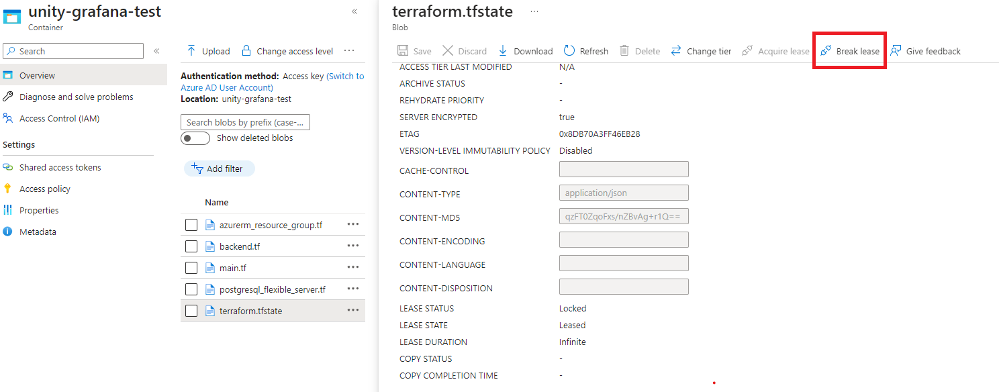

**Table of Contents**

<!-- START doctoc generated TOC please keep comment here to allow auto update -->
<!-- DON'T EDIT THIS SECTION, INSTEAD RE-RUN doctoc TO UPDATE -->

- [Incident Recovery](#incident-recovery)
  - [Fix Broken Service Account Token](#fix-broken-service-account-token)
  - [Fix Missing or Broken Master Key](#fix-missing-or-broken-master-key)
  - [Fix Crashing UNITY Operator](#fix-crashing-unity-operator)
  - [Fix Terraform Locked State](#fix-terraform-locked-state)
  - [Automatic Alerts](#automatic-alerts)
    - [Known Issues](#known-issues)
  - [Restore Database Manually](#restore-database-manually)

<!-- END doctoc generated TOC please keep comment here to allow auto update -->

# Incident Recovery

The sections below describe certain incidents and how to recover from them.

## Fix Broken Service Account Token

It may happen that the service account token stored in GHE secrets gets invalid or the user deletes it by accident.

This can be fixed by running the
[`recreate-app-service-account`](https://atc-github.azure.cloud.bmw/UNITY/unity/actions/workflows/recreate-app-service-account.yaml)
workflow, which recreates the token on the k8s cluster and stores it in the GHE secrets for the selected environment
and repos matching the specified regular expression.

## Fix Missing or Broken Master Key

To encrypt the secrets in an automated way, the master key must be stored in GHE.

This (or fixing a broken master key) can be achieved by running the
[`sync-master-keys-from-k8s-to-gh`](https://atc-github.azure.cloud.bmw/UNITY/unity/actions/workflows/sync-master-keys-from-k8s-to-gh.yaml)
workflow, which stores the master key in GHE for the selected environment and repos matching the specified regular
expression as `CRYPT_MASTER_KEY` (or updates the existing one if overwrite is set to true).

## Fix Crashing UNITY Operator

In case, the UNITY operator is in a crashing looping state, because one app is configured such that it breaks the
operator (which should not happen).
To make sure the UNITY operator gets into normal state, one can exclude an app (causing the issue) from being handled by
the unity-operator.

To do so, annotate the app's secret with `unity-operator.unity.bmwgroup.net/disabled: 'true'`. This can be done by
running

```bash
kubectl annotate secret app-foo --overwrite unity-operator.unity.bmwgroup.net/disabled=true
```

⚠️ After the root cause of the issue was solved, the annotation must be set back to `false` manually.

## Fix Terraform Locked State

Sometimes it might happen that all terraform operations fail because of being in a locked state. There are two possibilities
to recover from this situation:

- via the Azure portal UI, the lease can be broken:
  

- by running the Terraform command `force-unlock`
```bash
azcopy login
azcopy copy https://unitytestv3.blob.core.windows.net/unity-grafana-test . --recursive
cd unity-grafana-test
terraform force-unlock <LOCK_ID>
```

## Automatic Alerts

There are several automatic alerts which result in both Teams messages on the configured channels and ITSM incidents being
created. The situations which result in automatic alerts are the following:

- when one of the platform components is not working on either INT or PROD (unity-operator, oauth2-proxy, grafana, grafana-tempo).
In this case, the UNITY team needs to analyze the problem and come up with a solution (a quick temporary fix to bring the
component back into a running state and, if necessary, a follow-up fix in the code to prevent the problem from occurring again)

- when an application is not working on PROD. In this case, the UNITY team needs to analyze the problem and determine if
it is caused by the platform or by the application. In case the problem is caused by the platform, the same steps which
are done in case platform components are done, need to be followed here. In case the problem is within the application,
it needs to be informed (via an incident).

The service group corresponding to an application can be found in [Connect IT](https://connectit.muc), under the tab
`CMDB Information` (after searching for the application, by application ID)


### Known Issues

The following alert is triggered because the total memory limit is higher than the available memory in the cluster.


This is not be a problem unless the applications are simultaneously requesting more memory than the property set in
`container.resources.requests` in their `unity-app.*.yaml`, which is highly unlikely (for more information see the
[official documentation](https://kubernetes.io/docs/concepts/configuration/manage-resources-containers/#requests-and-limits)).

If this still happens, the problem can be fixed by raising the `container.resources.requests` to a value which is closer
to the `container.resources.limits`, which should trigger the creation of new nodes by the autoscaler.

## Restore Database Manually

In case a manual restore of the database server is needed (e.g. the server was accidentally deleted) it can be done by 
following these steps:

1. Recreate the azure resources for the database server through the `unity-app.*.yaml` with the exact same configuration.
2. In the backup storage account (azure portal): delete the newly created blob container and undelete the container
containing the backup to be restored (⚠️check the last modified timestamps, the names will be the same).
3. Create a secret with one of the access keys of the backup storage account. This secret will be used to mount the
azure file share containing the backup in the container to later restore it.
```yaml
apiVersion: v1
kind: Secret
metadata:
  name: restore-db-foo-storage-account 
  namespace: test
stringData:
  azurestorageaccountname: unitytestbackupv1 # the name of the storage account containing the backups
  azurestorageaccountkey: unitytestbackupv1_acceskey # one of the access keys to the storage account containing the backups
type: Opaque
```
4. Create a job to restore the DB Server. The job has two steps, first the `initContainer` copies the backup from
the blob container to the azure file share then the backup will be restored into the database server created in the first step.
```yaml
apiVersion: batch/v1
kind: Job
metadata:
  name: app-test-pfs-db-foo-restore-backup
  namespace: test
spec:
  template:
    spec:
      initContainers:
      - args:
        - -c
        - echo $AZURE_CLIENT_CERT_PFX_B64 | base64 -d > $AZCOPY_SPA_CERT_PATH;
          mkdir /backupfileshare/app-test-pfs-db-foo;
          azcopy copy "https://unitytestbackupv1.blob.core.windows.net/app-test-pfs-db-foo/app-test-pfs-db-foo.tar" /backupfileshare/app-test-pfs-db-foo;
        command:
        - sh
        env:
        - name: AZCOPY_AUTO_LOGIN_TYPE
          value: SPN
        - name: AZCOPY_TENANT_ID
          value: tenant-id # the azure tenant id
        - name: AZCOPY_SPA_CERT_PATH
          value: /tmp/cert.pfx
        - name: AZCOPY_SPA_APPLICATION_ID
          value: application-id # the client id of the service principal
        - name: AZCOPY_LOG_LOCATION
          value: /tmp
        - name: AZCOPY_JOB_PLAN_LOCATION
          value: /tmp
        - name: AZURE_CLIENT_CERT_PFX_B64
          value: client-certificate # the certificate to the SP base64 encoded
        image: containers.atc-github.azure.cloud.bmw/unity/azcopy:2023-07-04t082112z-52b72fd # the latest azcopy image
        name: blob-to-fileshare
        resources:
          limits:
            cpu: 500m
            memory: 512Mi
          requests:
            cpu: 200m
            memory: 256Mi
        securityContext:
          allowPrivilegeEscalation: false
          capabilities:
            drop:
            - ALL
          readOnlyRootFilesystem: false
        volumeMounts:
        - mountPath: /backupfileshare
          name: backupfileshare
      imagePullSecrets:
      - name: containers.atc-github.azure.cloud.bmw
      containers:
      - args:
        - -c
        - |
          set -eux
          cd /backupfileshare/db-foo
          tar -xvf db-foo.tar
          gzip -d -c backup-all.gz > backup-all.out
          psql -f backup-all.out postgres
          rm backup-all.gz
          rm backup-all.out
          gzip -d -c backup-postgres.gz > backup-postgres.out
          psql -f backup-postgres.out postgres
          rm backup-postgres.gz
          rm backup-postgres.out
        command:
        - bash
        env:
        - name: PGHOST
          value: db-foo.postgres.database.azure.com
        - name: PGUSER
          value: postgres
        - name: PGPASSWORD
          value: password
        image: postgres:14 
        name: restore
        resources:
          limits:
            cpu: 500m
            memory: 512Mi
          requests:
            cpu: 200m
            memory: 256Mi
        securityContext:
          allowPrivilegeEscalation: false
          capabilities:
            drop:
            - ALL
          readOnlyRootFilesystem: false
        volumeMounts:
        - mountPath: /backupfileshare
          name: backupfileshare
      restartPolicy: OnFailure
      securityContext:
        runAsNonRoot: true
        runAsUser: 10000
        runAsGroup: 10000
        seccompProfile:
          type: RuntimeDefault
      volumes:
      - csi:
          driver: file.csi.azure.com
          volumeAttributes:
            secretName: db-foo-storage-account-secret
            shareName: db-foo
        name: backupfileshare
  ttlSecondsAfterFinished: 86400
```
⚠️ It's important to follow the `<app-name>-pfs-<db-server-name>-restore-backup` pattern when naming the job, 
this will prevent the operator to execute any update on the database during the restore process.
5. If everything went well and the database is restored delete the secret created in step 3.