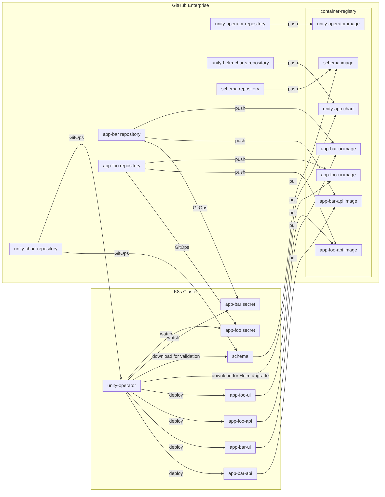

**Table of Contents**

<!-- START doctoc generated TOC please keep comment here to allow auto update -->
<!-- DON'T EDIT THIS SECTION, INSTEAD RE-RUN doctoc TO UPDATE -->

- [Kubernetes](#kubernetes)
  - [Architecture](#architecture)
  - [Labels](#labels)

<!-- END doctoc generated TOC please keep comment here to allow auto update -->

# Kubernetes

## Architecture

The following diagram gives an overview on the integration of GitHub Enterprise and Kubernetes architecture.



## Labels

All objects managed in Kubernetes MUST have the following labels:

* `app.kubernetes.io/name` the name of the repo, e.g. `app.kubernetes.io/name: app-foo`.
* `app.kubernetes.io/managed-by` the name of the responsible management component,
  e.g. `app.kubernetes.io/managed-by: unity` or `app.kubernetes.io/managed-by: Helm`.
  If set set `unity` it indicates the resources was created by a workflow from
  the [UNITY/unity](https://atc-github.azure.cloud.bmw/UNITY/unity) repo.
  Resources that are managed by `Helm`, are usually created by
  the [unity-operator](https://atc-github.azure.cloud.bmw/UNITY/unity-operator) and should not be edited manually.
* `app.kubernetes.io/component` the name of the component of the app, this is optional and not set on all resources.
  An example is `app.kubernetes.io/component: api` if the deployment or pod belongs to the deployable `api` of the app `
  foo.

To get all resources that are managed by `unity` for the app `foo` run:

```bash
kubectl get all,secrets,rolebindings,roles \
  -l app.kubernetes.io/name=app-foo,app.kubernetes.io/managed-by=unity
```

To get all resources of the component `api` from the app `foo` run:

```bash
kubectl get all,secrets,rolebindings,roles \
  -l app.kubernetes.io/name=app-foo,app.kubernetes.io/component=api
```

