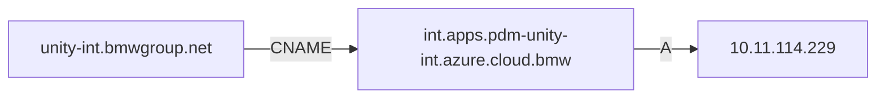
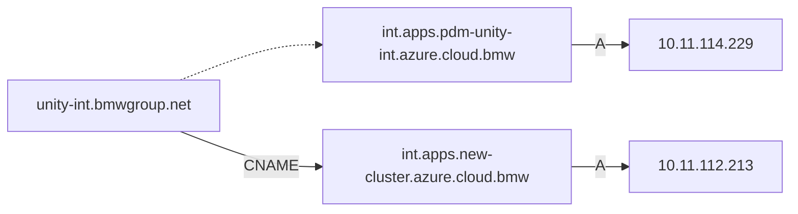

**Table of Contents**

<!-- START doctoc generated TOC please keep comment here to allow auto update -->
<!-- DON'T EDIT THIS SECTION, INSTEAD RE-RUN doctoc TO UPDATE -->

- [Networking](#networking)
  - [DNS](#dns)
  - [Migrating to a New Cluster](#migrating-to-a-new-cluster)

<!-- END doctoc generated TOC please keep comment here to allow auto update -->

# Networking

UNITY exposes all apps and infrastructure under one domain (per environment).

* [unity-test.bmwgroup.net](https://unity.bmwgroup) (for UNITY platform development only)
* [unity-int.bmwgroup.net](https://unity.bmwgroup) (for UNITY app testing and integration)
* [unity.bmwgroup.net](https://unity.bmwgroup) (production use)

## DNS



For each domain, a DNS [CNAME record](https://www.cloudflare.com/learning/dns/dns-records/dns-cname-record/) is
registered, which points to Kubernetes clusters DNS.

Here is an example on how to resolve the record.

```console
$ nslookup unity-int.bmwgroup.net
Server:		160.50.252.20
Address:	160.50.252.20#53

Non-authoritative answer:
unity-int.bmwgroup.net	canonical name = int.apps.pdm-unity-int.azure.cloud.bmw.
Name:	int.apps.pdm-unity-int.azure.cloud.bmw
Address: 10.11.114.229
```

This shows, that the CNAME is `int.apps.pdm-unity-int.azure.cloud.bmw`.
For the CNAME, an additional [A record](https://www.cloudflare.com/learning/dns/dns-records/dns-a-record/) resolves to
the IP of the ingress controller.

```console
$ nslookup int.apps.pdm-unity-int.azure.cloud.bmw
Server:		160.50.250.20
Address:	160.50.250.20#53

Non-authoritative answer:
Name:	int.apps.pdm-unity-int.azure.cloud.bmw
Address: 10.11.114.229
```

## Migrating to a New Cluster

When migrating one environment to a new cluster, first the
entire [unity-chart](https://atc-github.azure.cloud.bmw/UNITY/unity-chart) is deployed to that new cluster and
namespace. Next, all apps need to deployed there as well.
Assume, the new cluster can be reached under `int.apps.new-cluster.azure.cloud.bmw`.
Before changing the CNAME record, the new cluster can be tested. For example, to test that routing and certificates
work as expected for the oauth2-proxy, resolve the ip of the new cluster:

```console
$ nslookup int.apps.new-cluster.azure.cloud.bmw
Server:         160.50.250.20
Address:        160.50.250.20#53

Non-authoritative answer:
Name:   int.apps.new-cluster.azure.cloud.bmw
Address: 10.11.112.213
```

Next, use this ip, to connect to the oauth2-proxy:

```bash
curl -v --resolve unity-int.bmwgroup.net:443:10.11.112.213 https://unity-int.bmwgroup.net/oauth2-proxy/ping
```

Note that certificate validation (`-k`) MUST NOT be used, to check that certificates are set up correctly.
The output of the curl command should also show the certificates `subjectAltName`:

```console
$ curl -v --resolve unity-int.bmwgroup.net:443:10.11.112.213 https://unity-int.bmwgroup.net/oauth2-proxy/ping
* Added unity-int.bmwgroup.net:443:10.11.112.213 to DNS cache
*   Trying 10.11.112.213:443...
* Connected to unity-int.bmwgroup.net (10.11.112.213) port 443 (#0)
* ALPN, offering h2
* ALPN, offering http/1.1
* successfully set certificate verify locations:
*  CAfile: /etc/ssl/cert.pem
*  CApath: none
* (304) (OUT), TLS handshake, Client hello (1):
* (304) (IN), TLS handshake, Server hello (2):
* (304) (IN), TLS handshake, Unknown (8):
* (304) (IN), TLS handshake, Certificate (11):
* (304) (IN), TLS handshake, CERT verify (15):
* (304) (IN), TLS handshake, Finished (20):
* (304) (OUT), TLS handshake, Finished (20):
* SSL connection using TLSv1.3 / AEAD-AES256-GCM-SHA384
* ALPN, server accepted to use h2
* Server certificate:
*  subject: C=DE; ST=Bavaria; L=Munich; O=Bayerische Motoren Werke AG; OU=PKI Services; CN=d938ec195a13fd003b38e4706d2a656fc5fdaa5d61bd9ba277d5f.cloud.bmw
*  start date: Oct 14 13:02:55 2022 GMT
*  expire date: Nov 15 13:02:55 2023 GMT
*  subjectAltName: host "unity-int.bmwgroup.net" matched cert's "unity-int.bmwgroup.net"
*  issuer: DC=corp; DC=bmw; DC=europe; CN=BMW Group Issuing CA SSL1
*  SSL certificate verify ok.
* Using HTTP2, server supports multiplexing
* Connection state changed (HTTP/2 confirmed)
* Copying HTTP/2 data in stream buffer to connection buffer after upgrade: len=0
* Using Stream ID: 1 (easy handle 0x7f7fcf810400)
> GET /oauth2-proxy/ping HTTP/2
> Host: unity-int.bmwgroup.net
> user-agent: curl/7.79.1
> accept: */*
>
* Connection state changed (MAX_CONCURRENT_STREAMS == 512)!
< HTTP/2 200
< date: Fri, 25 Nov 2022 05:37:32 GMT
< content-type: text/plain; charset=utf-8
< content-length: 2
< strict-transport-security: max-age=15724800; includeSubDomains
<
* Connection #0 to host unity-int.bmwgroup.net left intact
OK
```

If the response is `OK`, everything looks good.

Next, change the CNAME record to point to the new cluster via a service request to `ntwk-dns-dhcp-sup:global`, see
INC000040799101 for an example.
This will route all traffic to the new cluster without any downtime.

Note that it will take the old CNAME record's [TTL](https://www.cloudflare.com/learning/cdn/glossary/time-to-live-ttl/)
until all traffic is safely routed to the new cluster.
Check the TTL with `nslookup` to know how long to wait with the decommissioning of the old cluster:

```console
$ nslookup -debug unity-int.bmwgroup.net
Server:         160.50.250.20
Address:        160.50.250.20#53

------------
    QUESTIONS:
        unity-int.bmwgroup.net, type = A, class = IN
    ANSWERS:
    ->  unity-int.bmwgroup.net
        canonical name = int.apps.pdm-unity-int.azure.cloud.bmw.
        ttl = 2392
    ->  int.apps.pdm-unity-int.azure.cloud.bmw
        internet address = 10.11.114.229
        ttl = 381
    AUTHORITY RECORDS:
    ADDITIONAL RECORDS:
------------
Non-authoritative answer:
unity-int.bmwgroup.net  canonical name = int.apps.pdm-unity-int.azure.cloud.bmw.
Name:   int.apps.pdm-unity-int.azure.cloud.bmw
Address: 10.11.114.229
```

The output above indicates a TTL for 2392 seconds the CNAME and 381 seconds for the A record.
These numbers will change when the lookup is repeated, as they indicate when to refresh the cached DNS entry.


