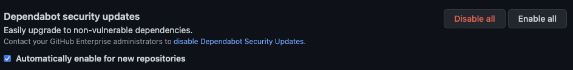
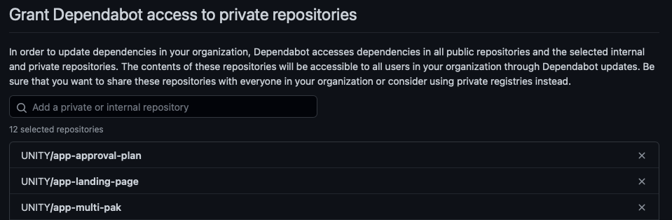

**Table of Contents**

<!-- START doctoc generated TOC please keep comment here to allow auto update -->
<!-- DON'T EDIT THIS SECTION, INSTEAD RE-RUN doctoc TO UPDATE -->

- [Regular Activities](#regular-activities)
  - [Update Quarkus Version](#update-quarkus-version)
  - [Update Angular Version](#update-angular-version)
  - [Enable Dependabot on All Repos](#enable-dependabot-on-all-repos)
  - [Certificates](#certificates)

<!-- END doctoc generated TOC please keep comment here to allow auto update -->

# Regular Activities

There are some tasks, which must be executed by the UNITY team on a regular basis, as these cannot be fully automated.

## Update Quarkus Version

The [create-quarkus-app.bash](https://atc-github.azure.cloud.bmw/UNITY/unity/blob/main/.github/actions/make-quarkus-stub/create-quarkus-app.bash)
contains instructions
from [Bootstrapping the project](https://quarkus.io/guides/getting-started#bootstrapping-the-project)
The version will be bumped by dependabot when a new version is available. The pull requests from dependabot need to be
reviewed, merged and the workflow should be tested afterwards.

## Update Angular Version

The [create-angular-app.bash](https://atc-github.azure.cloud.bmw/UNITY/unity/blob/main/.github/workflows/make-stub.yaml)
contains a variable for the current Angular major version to use:

```yaml
ANGULAR_VERSION: '16'
```

As soon as a new major angular version is release, which can be found e.g.
on [angular-cli release](https://github.com/angular/angular-cli/releases) it should be bumped to that new major version.
In addition, dependencies like `@bmw-ds/components@latest` need to be checked to be compatible with the new Angular
major version.

## Enable Dependabot on All Repos

Currently, there is no API to provide dependabot access to a new private repository. That means, dependabot cannot be
granted access to dependabot on repository creation.
Instead, the "Enable All" button
on [Dependabot security updates](https://atc-github.azure.cloud.bmw/organizations/UNITY/settings/security_analysis)
should be clicked.



In the end, all private repositories should be listed under "Grant Dependabot access to private repositories".



## Certificates

To keep the trust store up to date, any new certificate published on
[Root and Intermediate Certificates](https://atc.bmwgroup.net/confluence/x/_AbLJQ)
must be added to
[bmw-certificates](https://atc-github.azure.cloud.bmw/UNITY/unity-helm-charts/tree/main/charts/bmw-certificates)
and released as new chart version.
All charts depending on `bmw-certificates` need to be updated and bumped as well.
Search for
[org:UNITY filename:Chart.yaml bmw-certificates](https://atc-github.azure.cloud.bmw/search?q=org%3AUNITY+filename%3AChart.yaml+bmw-certificates&type=code)
to find all places.
